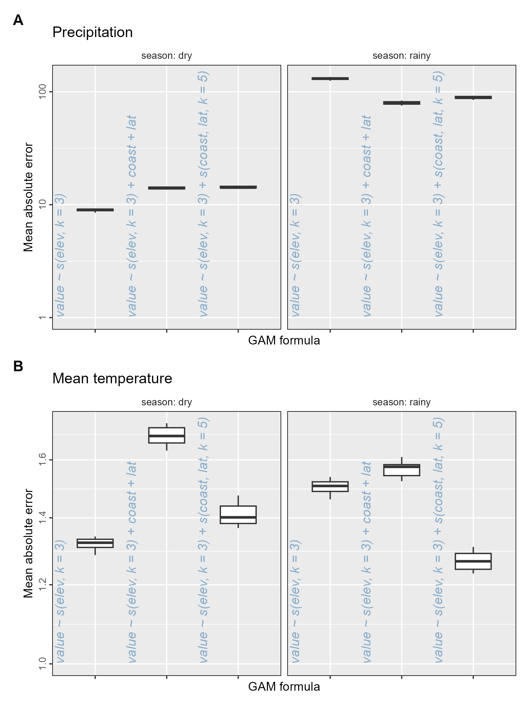
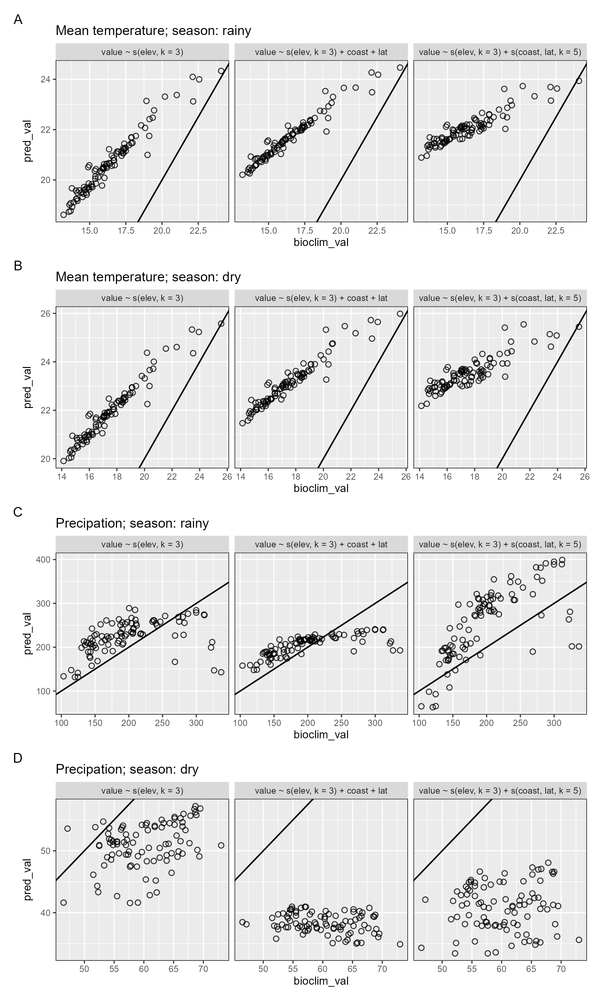
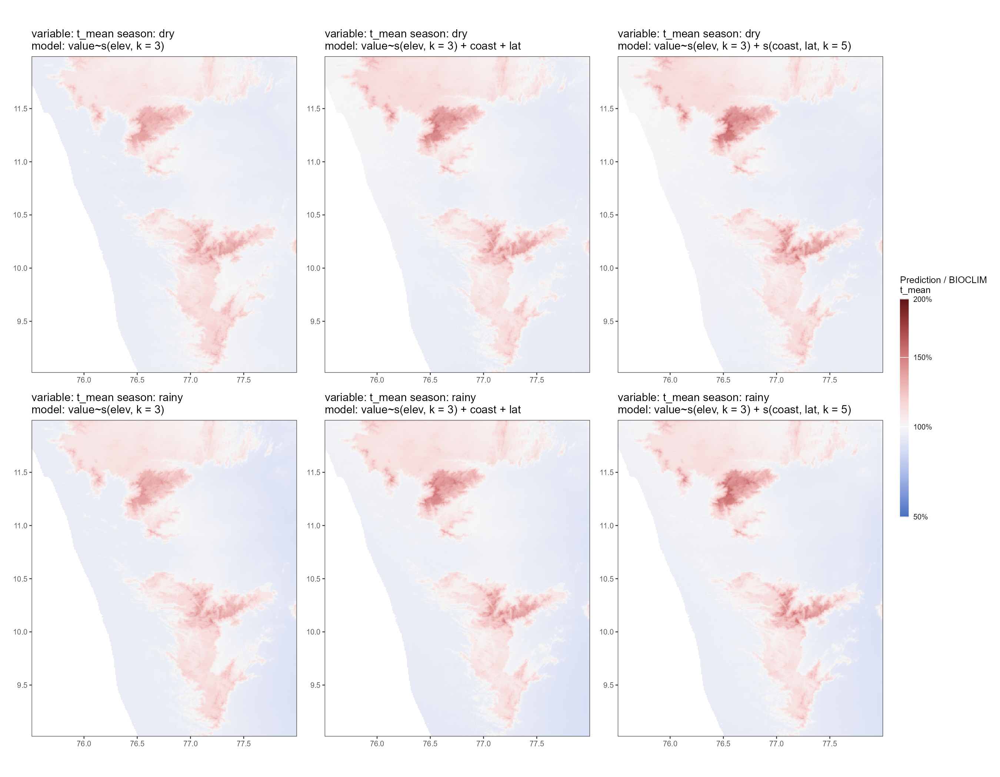
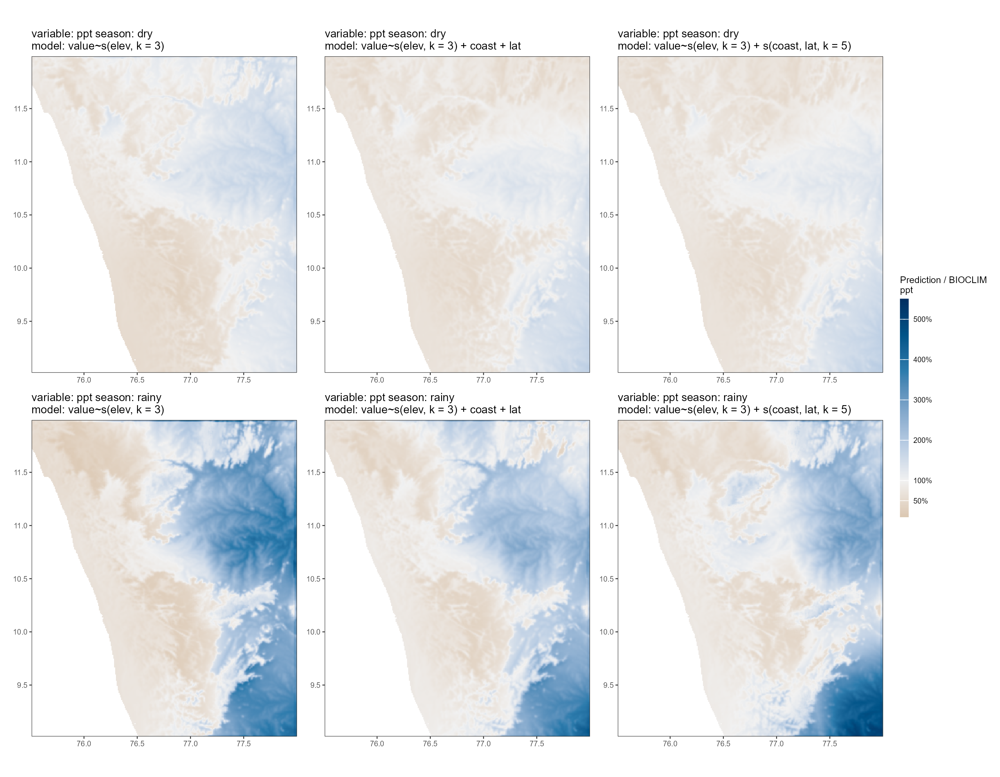

# Building a correction layer for climate predictions

In this section we focus on quantifying the error over the entire study site between model-predicted climate and climate measures derived from remote sensing data (from BIOCLIM, and referred to as CHELSA data).
We then use these differences to create a 'correction layer', that allows us to scale the model predictions for historical data.

The assumption is that the correction layer is applicable to historical climate model predictions.

## Load libraries

```{r}
library(tidyverse)
library(ggplot2)
library(colorspace)
library(patchwork)
library(terra)
library(stars)
```

```{r}
error_data <- read_csv("results/climate/data_gam_comparison_mae.csv")
survey_clim <- read_csv("results/climate/data_gam_compare_survey_sites.csv")

# load saved object from previous script
load("results/climate/model_pred_climate.Rds")
```

## Plot model error

Here we plot the mean absolute error (MAE) between CHELSA data and model predicted data in each season (dry or rainy) using boxplots.
Recall that this is for the 10,000 sampled locations split into 10 groups of 1,000 locations to calculate MAE.

```{r}
# Nest data by climate variable
error_data <- nest(
  error_data,
  data = !c("climvar")
)

# Get the distinct values of the model formulae
forms <- distinct(survey_clim, form = forms)

# Map over each climate variable, producing a list of ggplots
plots <- map2(
  error_data$data, error_data$climvar,
  function(df, cl) {
    ggplot(df) +
      geom_boxplot(
        aes(
          forms, mae
        ),
        width = 0.5
      ) +
      geom_text(
        data = forms,
        aes(
          form, 1,
          label = form
        ),
        angle = 90,
        hjust = "inward",
        nudge_x = -0.5,
        col = "steelblue",
        alpha = 0.6,
        fontface = "italic"
      ) +
      scale_y_log10() +
      facet_wrap(
        ~season,
        labeller = label_both
      ) +
      theme_grey(base_size = 10) +
      theme(
        strip.background = element_blank(),
        axis.text.y = element_text(
          angle = 90,
          hjust = 0.5
        ),
        axis.text.x = element_blank(),
        panel.border = element_rect(
          fill = NA, colour = "black"
        )
      ) +
      labs(
        x = "GAM formula",
        y = "Mean absolute error",
        title = ifelse(
          cl == "ppt",
          "Precipitation",
          "Mean temperature"
        )
      )
  }
)

# Combine into a single plot to save
plots <- wrap_plots(
  plots,
  ncol = 1
) +
  plot_annotation(
    tag_levels = "A"
  ) &
  theme(
    plot.tag = element_text(
      face = "bold"
    )
  )

# Save the plot for future reference
ggsave(
  plots,
  filename = "figs/fig_compare_models_general.png",
  width = 6,
  height = 8
)
dev.off()
```



## Compare climate predictions at survey sites

Next we plot the model-predicted climate variable values against the equivalent remote-sensing derived climate values at each of the modern resurvey locations, separating by model formulation and season.

```{r}
# Nest the data by climate variable and season
survey_clim <- group_by(survey_clim, climvar, season) |>
  nest()

# For each climate variable and season, produce a separate plot
# Plots form a list of ggplot objects
plots_survey_pts <- Map(
  survey_clim$climvar, survey_clim$data, survey_clim$season,
  f = function(cvar, df, season) {
    ggplot(
      df
    ) +
      geom_abline(
        slope = 1
      ) +
      geom_point(
        aes(bioclim_val, pred_val),
        shape = 1,
        alpha = 0.8
      ) +
      scale_y_continuous() +
      facet_grid(
        ~forms,
        scales = "free",
        labeller = labeller(
          .multi_line = F,
          season = label_both
        )
      ) +
      theme_grey(
        base_size = 8
      ) +
      theme(
        legend.position = "top",
        panel.border = element_rect(
          fill = NA, colour = "black"
        )
      ) +
      labs(
        colur = "Model",
        title = ifelse(
          cvar == "ppt",
          glue::glue("Precipation; season: {season}"),
          glue::glue("Mean temperature; season: {season}")
        )
      )
  }
)

# Combine plots into a single plot
plots_survey_pts <- wrap_plots(
  plots_survey_pts,
  ncol = 1
) +
  plot_annotation(
    tag_levels = "A"
  )

# Save the plot for future reference
ggsave(
  plots_survey_pts,
  filename = "figs/fig_survey_site_model_comparison.png",
  height = 10, width = 6
)
```



## Visualise model predictions as proportion of remote sensing data

Here, we obtain the model-predicted climate data (for each variable in each season) and express it as a proportion of the CHELSA value for the same variable, which we take as the canonical value.

```{r}
# Read in the raster data of model predictions
gam_validation_pred <- terra::rast("results/climate/gam_pred_valid_avg.tif") |>
  as.list()

# Read in the data for season, climate variable, and model formulation
gam_validation_id <- read_csv("results/climate/gam_model_formulas.csv")

# Select only data for climate variables precip. and temp. mean
# and assign raster data as a list column
gam_validation_pred <- gam_validation_pred[gam_validation_id$climvar %in%
  c("ppt", "t_mean")]
gam_validation_id <- filter(gam_validation_id, climvar %in% c("ppt", "t_mean"))

gam_validation_data <- mutate(
  gam_validation_id,
  prediction = gam_validation_pred
)
```

Next we load the BIOCLIM data and prepare variables that allow it to be merged with the model-predictions dataframe.

```{r}
# Read in BIOCLIM/CHELSA rasters
chelsa_temp <- terra::rast("results/climate/chelsa_temp_stack.tif") |>
  as.list()
chelsa_ppt <- terra::rast("results/climate/chelsa_ppt_stack.tif") |>
  as.list()

# Make a dataframe with combinations of season and climate variable
# and assing the raster data as a list column
chelsa_data <-
  crossing(
    season = c("rainy", "dry"),
    climvar = c("t_mean", "ppt")
  ) |>
  arrange(desc(climvar), desc(season)) |>
  mutate(
    chelsa_rast = append(chelsa_temp, chelsa_ppt)
  )
```

We merge the CHELSA data with the model-prediction and get the scaling layer (called 'residual'), which is the prediction as a proportion of the canonical CHELSA data.

```{r}
# link prediction and residual
gam_validation_data <- gam_validation_data |>
  left_join(chelsa_data)

gam_validation_data <- mutate(
  gam_validation_data,
  residual = map2(chelsa_rast, prediction, function(ch, pr) {
    pr <- terra::resample(pr, ch) # resampling required
    pr / ch
  })
)
```

## Temperature scaling layer

We plot the scaling layer for temperature. The general pattern is that all models overestimate temperature in hilly regions of the study area; higher elevations have a higher ratio of prediction to CHELSA in all models.
In contrast, lower elevations have a prediction to CHELSA ratio close to 1.0 in all models, i.e., the model prediction is relatively good in the non-hilly areas.

```{r}
plots_temp_resid <- filter(gam_validation_data, climvar == "t_mean") |>
  select(-prediction, -chelsa_rast)

plots_temp_resid <- pmap(
  plots_temp_resid,
  .f = function(season, climvar, forms, residual) {
    residual <- st_as_stars(residual)
    ggplot() +
      geom_stars(
        data = residual
      ) +
      scale_fill_continuous_diverging(
        palette = "Blue-Red 3",
        mid = 1,
        na.value = "transparent",
        name = glue::glue("Prediction / BIOCLIM
                          {climvar}"),
        limits = c(0.5, 2),
        labels = scales::percent,
        trans = ggallin::ssqrt_trans
      ) +
      theme_test(base_size = 6) +
      theme(
        legend.position = "right",
        legend.key.height = unit(10, "mm"),
        legend.key.width = unit(2, "mm"),
        axis.title = element_blank()
      ) +
      coord_sf(
        expand = F
      ) +
      labs(
        title = glue::glue("variable: {climvar} season: {season}
                           model: {forms}")
      )
  }
) |> wrap_plots(
  guides = "collect"
) &
  theme(
    legend.position = "right"
  )

plots_temp_resid[[1]]
```

## Precipitation scaling layer

We plot the scaling layer for precipitation. The general pattern is that all models overestimate precipitation on the leeward side of the study area, i.e., in the rain shadow of the Western Ghats, while underestimating precipitation on the windward side.
This makes sense as the driver of canonical variation is largely the blocking of monsoon winds and associated rainfall by the Ghats; while this could be expected to be captured by the distance-to-coast variable, it does not appear to do so well.

The underestimation of precipitation on the windward side is more pronounced in the rainy season, which is expected.
Higher elevations also have a lower prediction to CHELSA ratio than lower elevations on the windward side.

```{r}
plots_ppt_resid <- filter(gam_validation_data, climvar == "ppt") |>
  select(-prediction, -chelsa_rast)
plots_ppt_resid <- pmap(
  plots_ppt_resid,
  .f = function(season, climvar, forms, residual) {
    residual <- st_as_stars(residual)
    ggplot() +
      geom_stars(
        data = residual
      ) +
      scale_fill_continuous_diverging(
        palette = "Vik",
        rev = TRUE, mid = 1,
        na.value = "transparent",
        name = glue::glue("Prediction / BIOCLIM
                          {climvar}"),
        limits = c(0.1, 5.5),
        labels = scales::percent,
        breaks = c(0.01, 0.5, seq(0.0, 5.5, 1))
      ) +
      theme_test(base_size = 6) +
      theme(
        legend.position = "right",
        legend.key.height = unit(10, "mm"),
        legend.key.width = unit(2, "mm"),
        axis.title = element_blank()
      ) +
      coord_sf(
        expand = F
      ) +
      labs(
        title = glue::glue("variable: {climvar} season: {season}
                           model: {forms}")
      )
  }
) |> wrap_plots(
  guides = "collect"
) &
  theme(
    legend.position = "right"
  )

plots_ppt_resid[[1]]
```

```{r}
# Save the scaling layer plots for future reference
ggsave(
  plots_temp_resid,
  filename = "figs/fig_temp_resid.png",
  width = 9, height = 7
)

ggsave(
  plots_ppt_resid,
  filename = "figs/fig_ppt_resid.png",
  width = 9, height = 7
)
```





## Save climate scaling layers

Looking at the GAM predictions as proportions of the BIOCLIM layers, we can choose model formulas for each season and each variable that lead to predictions that are closest to the real BIOCLIM values. We choose formulas on the basis of observed deviation from the true value, as well as spatial contiguity of deviations, basically, are nearby areas similarly different from true values. For example, there is an odd north east regional deviation for rainfall in the wet season for the forumla $\text{ppt} ~ s(\text{elevation}, k = 3) + s(\text{distance to coast, latitude}, k = 5)$, so we prefer to chose another formula.

This means we pick the simple $\text{temp} ~ s(\text{elevation}, k = 3)$ formula for mean monthly temperature, in both dry and wet seasons, and the $\text{ppt} ~ s(\text{elevation}, k = 3) + \text{distance to coast} + \text{latitude}$ formula for total monthly rainfall in both dry and wet seasons.

We then save the inverse proportion, BIOCLIM / prediction, as a correction layer --- one layer per season and variable.
This allows us to fit GAMs to chunks of historical climate data, using physical predictors as covariates, and to then correct the resulting spatial prediction using the correction layer.
Hence the 'true' historical value of a climate variable is $\text{GAM prediction} \times \text{correction factor}$, where the correction factor is the cell-specific value from the correction layers.

## Seasonal mean temperature correction layer

We prepare the season-specific mean temperature correction layer.

```{r}
# Subset validation dataset
temp_correction_layer <- gam_validation_data %>%
  filter(
    climvar == "t_mean",
    forms == "value~s(elev, k = 3)"
  )

# Get the correction layer as CHELSA / prediction
temp_correction_layer <- mutate(
  temp_correction_layer,
  correction_layer = map2(
    chelsa_rast, prediction, function(ch, pr) {
      pr <- terra::resample(pr, ch) # resampling required
      ch / pr
    }
  )
)

# Make the correction layer a single raster stack object and name correctly
temp_correction_layer <- Reduce(
  temp_correction_layer$correction_layer,
  f = c
)

# Set names for layers
names(temp_correction_layer) <- c(
  "correction_layer_temp_dry",
  "correction_layer_temp_wet"
)

# Save the correction layer
terra::writeRaster(
  temp_correction_layer,
  filename = "results/climate/raster_correction_layers_temp.tif"
)
```

## Seasonal total rainfall correction layer

We prepare the season-specific total precipitation correction layer.

```{r}
# Subset validation dataset
ppt_correction_layer <- gam_validation_data %>%
  filter(
    climvar == "ppt",
    forms == "value~s(elev, k = 3) + coast + lat"
  )

# Now get the correction layer as CHELSA / prediction
ppt_correction_layer <- mutate(
  ppt_correction_layer,
  correction_layer = map2(
    chelsa_rast, prediction, function(ch, pr) {
      pr <- terra::resample(pr, ch) # resampling required
      ch / pr
    }
  )
)

# Make the correction layer a single raster stack object and name correctly
ppt_correction_layer <- Reduce(
  ppt_correction_layer$correction_layer,
  f = c
)

# Set names for layers
names(ppt_correction_layer) <- c(
  "correction_layer_ppt_dry",
  "correction_layer_ppt_wet"
)

# Save the layer
terra::writeRaster(
  ppt_correction_layer,
  filename = "results/climate/raster_correction_layers_ppt.tif"
)
```
