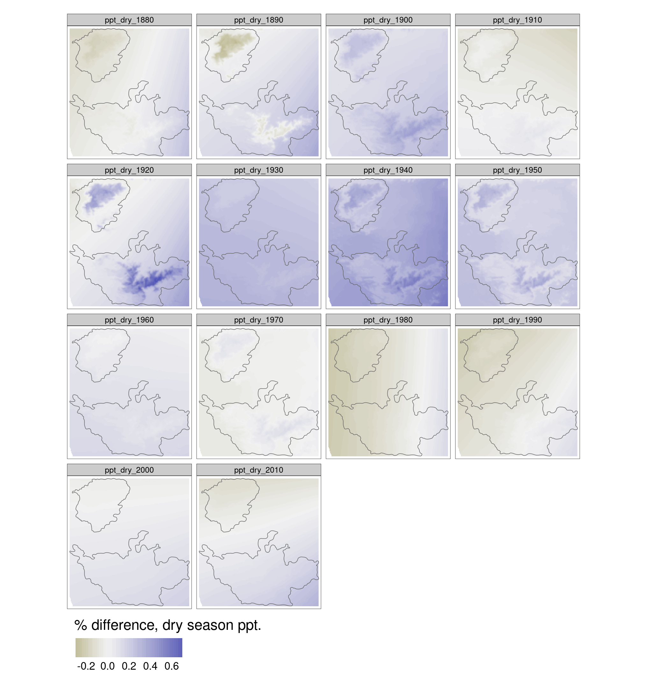
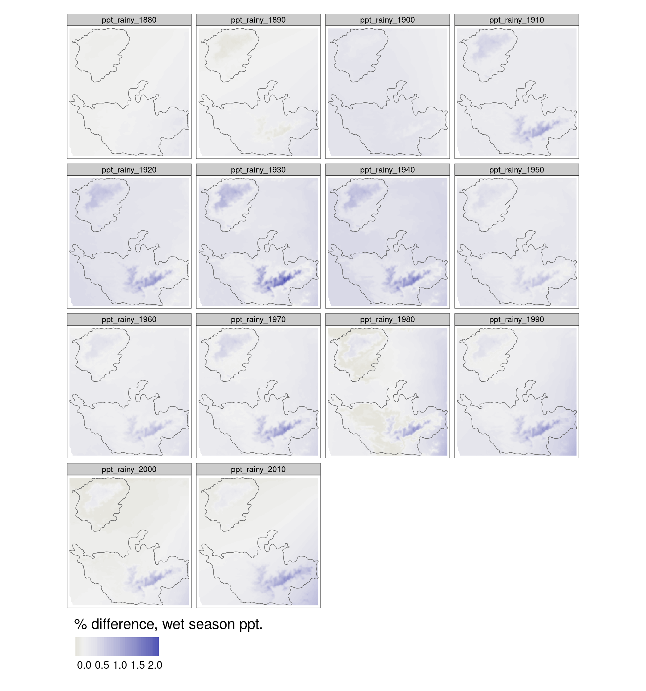
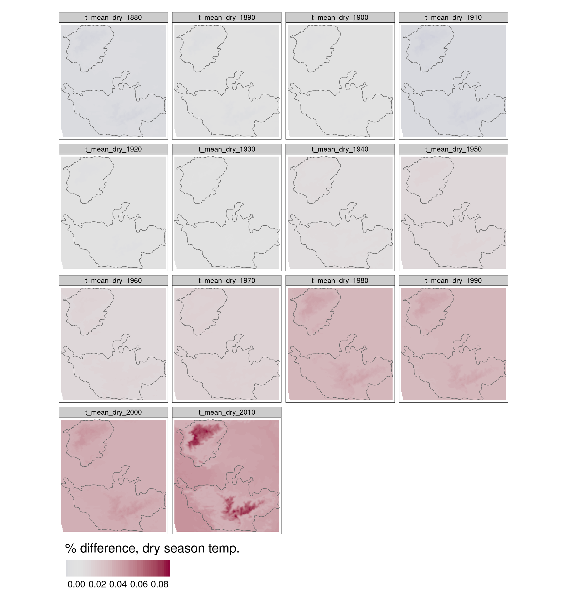
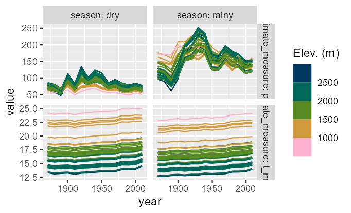

# Analyzing temperature and precipitation change over time

In this script, we will process the reconstructed climate data and analyze trends in climate over time

## Load necessary libraries

```{r}
library(terra)
library(sf)
library(stringi)
library(glue)
library(purrr)
library(dplyr)
library(tidyr)
library(tibble)

# for plotting
library(viridis)
library(colorspace)
library(tmap)
library(scales)
library(ggplot2)
library(patchwork)

# for GLMMS
library(mgcv)
```

```{r}
# load nilgiris
hills <- st_read("data/landcover/Nil_Ana_Pal.shp")

# get reconstructions
climate_reconstructed <- list.files(
  "results/climate",
  pattern = "raster_reconstructed",
  full.names = T
) |>
  lapply(rast)

# get differences with respect to first reconstruction
climate_change <- lapply(climate_reconstructed, function(le) {
  le <- le / le[[1]]
  le <- le[[-1]]
  le <- le - 1
  terra::crop(
    le, vect(hills)
  )
})
```

## Plot change in climate as percentages.

```{r}
ppt_dry_change <- tm_shape(climate_change[[1]]) +
  tm_raster(
    palette = colorspace::diverging_hcl(
      31,
      palette = "Blue-Yellow",
      rev = T
    ),
    style = "cont", midpoint = 0,
    title = "% difference, dry season ppt.",
    legend.is.portrait = F
  ) +
  tm_shape(hills) +
  tm_borders() +
  tm_legend(
    legend.outside = T,
    legend.outside.position = "bottom",
    legend.outside.size = .1
  )

tmap_save(
  ppt_dry_change,
  filename = "figs/fig_ppt_dry_change.png"
)
```



```{r}
ppt_wet_change <- tm_shape(climate_change[[2]]) +
  tm_raster(
    palette = colorspace::diverging_hcl(
      31,
      palette = "Blue-Yellow",
      rev = T
    ),
    style = "cont", midpoint = 0,
    title = "% difference, wet season ppt.",
    legend.is.portrait = F
  ) +
  tm_shape(hills) +
  tm_borders() +
  tm_legend(
    legend.outside = T,
    legend.outside.position = "bottom",
    legend.outside.size = .1
  )

tmap_save(
  ppt_wet_change,
  filename = "figs/fig_ppt_wet_change.png"
)
```



```{r}
temp_dry_change <- tm_shape(climate_change[[3]]) +
  tm_raster(
    palette = colorspace::diverging_hcl(
      31,
      rev = F
    ),
    style = "cont", midpoint = 0,
    title = "% difference, dry season temp.",
    legend.is.portrait = F
  ) +
  tm_shape(hills) +
  tm_borders() +
  tm_legend(
    legend.outside = T,
    legend.outside.position = "bottom",
    legend.outside.size = .1
  )

tmap_save(
  temp_dry_change,
  filename = "figs/fig_temp_dry_change.png"
)
```



```{r}
temp_wet_change <- tm_shape(climate_change[[4]]) +
  tm_raster(
    palette = colorspace::diverging_hcl(
      31,
      rev = F
    ),
    style = "cont", midpoint = 0,
    title = "% difference, wet season temp.",
    legend.is.portrait = F
  ) +
  tm_shape(hills) +
  tm_borders() +
  tm_legend(
    legend.outside = T,
    legend.outside.position = "bottom",
    legend.outside.size = .1
  )

tmap_save(
  temp_wet_change,
  filename = "figs/fig_temp_wet_change.png"
)
```


## Load list of resurvey locations/historical sites of occurrence

```{r}
# load list of resurvey locations and add elevation as a variable
# remove the modern resurvey locations only (ie. ASFQ)
sites <- read.csv("data/list-of-resurvey-locations.csv")

# set missing historical site code to NA
sites <- mutate(sites,
  historical_site_code = if_else(
    historical_site_code == "", NA_character_, historical_site_code
  ),
  site_name = if_else(
    site_name == "", NA_character_, site_name
  )
)

# remove sites with historical site code missing
sites <- filter(sites, !is.na(historical_site_code))

# convert to sf object and transform
sites <- st_as_sf(sites, coords = c("longitude", "latitude")) %>%
  `st_crs<-`(4326) %>%
  st_transform(32643)

# add an outline of the nilgiris shapefile (contains areas below 1400 m)
nil <- st_read("data/landcover/Nil_Ana_Pal.shp")
nil <- nil[2, ]
nil <- st_transform(nil, 32643)
buffer <- st_buffer(nil, 3e4) %>%
  st_transform(4326)

# add the elevation raster
alt <- rast("data/elevation/alt/")

# this layer is not added to github as a result of its large size and can be downloaded from SRTM (Farr et al. (2007))
alt.hills <- terra::crop(alt, as(buffer, "Spatial"))
rm(alt)
gc()

# get slope and aspect
slopeData <- terrain(x = alt.hills, v = c("slope", "aspect"))
# use c() on terra object to combine as a stack
elevData <- c(alt.hills, slopeData)
rm(alt.hills)
gc()
```

## Load the climate rasters

Note that there are four rasters: temperature and precipitation for both dry season and rainy season respectively. The dry season refers to the months of December to May while the rainy season refers to the months of June to November. Each raster corresponds to mean monthly value across a single decade (1870-1890 and so on). In other words, ppt_dry_1870 would refer to the mean monthly precipitation between December to May for the time-period 1870 to 1880.  

```{r}
# use previously loaded climate reconstruction data
climate_reconstructed

# crop each reconstruction to the previously prepared buffer
# and transform/assign the crs of the site data
climate_reconst_nilgiris <- map(
  climate_reconstructed, function(cl) {
    cl <- terra::project(cl, crs(sites))
  }
)

# extract the above data for each of the resurvye locations
# use explicit namespacing of extract from terra, i.e., terra::extract
climate_reconst_sites <- lapply(climate_reconst_nilgiris, function(cl) {
  terra::extract(cl, as(sites, "SpatVector"))
})

# extract elevation, aspect, slope at sites
# first transform elevation data to UTM 43N
terrain_nilgiris <- terra::project(elevData, crs(sites))
terrain_sites <- terra::extract(terrain_nilgiris, as(sites, "SpatVector"))
```

## Combine site climate and terrain data

```{r}
# merge all extracted climate data at sites
climate_reconst_sites <- reduce(climate_reconst_sites, left_join)

# now convert to long format
climate_reconst_sites <- pivot_longer(
  climate_reconst_sites,
  cols = !ID,
  names_to = "climate_measure"
)

# split season and year column
climate_reconst_sites <- separate_wider_regex(
  climate_reconst_sites,
  cols = climate_measure,
  patterns = c(
    climate_measure = ".*", "_",
    season = "dry|rainy", "_",
    year = "\\d{4}"
  )
)

# join with terrain data
clim_terrain_sites <- left_join(
  climate_reconst_sites, terrain_sites
)

# add site data - first drop
sites <- st_drop_geometry(sites) %>%
  mutate(ID = seq(nrow(sites))) %>%
  as_tibble()

# join with site data
clim_terrain_sites <- left_join(
  clim_terrain_sites,
  sites
)

# make factors numerics
clim_terrain_sites <- mutate(
  clim_terrain_sites,
  year = as.numeric(year),
  alt = as.numeric(as.character(alt))
)

# save climate at sites
readr::write_csv(
  clim_terrain_sites,
  "data/results/clim_terrain_sites.csv"
)
```

## Plot all reconstructed climate over time colouring by elevation and grouping by site. Each line represents one modern site code.

```{r}
ggplot(
  clim_terrain_sites,
  aes(
    x = year, y = value,
    col = alt, group = modern_site_code
  )
) +
  geom_line(
    position = position_jitter(width = 0.2)
  ) +
  scale_colour_binned_sequential(
    palette = "Batlow"
  ) +
  facet_grid(
    rows = vars(climate_measure),
    cols = vars(season),
    scales = "free_y",
    labeller = label_both
  ) +
  labs(
    colour = "Elev. (m)"
  )

ggsave(
  filename = "figs/fig_clim_reconst_site_elev.png",
  dpi = 150
)
```



### Alternative figure for temperature change over time

```{r}
# get the mean proportional change in climate variables at sites
# binned by elevation (200m bins), separated by season
clim_prop_change <- clim_terrain_sites %>%
  mutate(
    elev_bin = plyr::round_any(alt, 200)
  ) %>%
  group_by(
    climate_measure, season, modern_site_code, elev_bin
  ) %>%
  mutate(
    prop_change = (value - first(value)) / first(value)
  )

# nest by climate variable for more visible colour scales
clim_prop_change <- ungroup(clim_prop_change) %>%
  nest(.by = "climate_measure")

# function for plotting
fn_plot <- function(df) {
  ggplot(df) +
    stat_summary_2d(
      aes(as.factor(year), as.factor(elev_bin), z = prop_change),
      col = "grey", linewidth = 0.1
    ) +
    facet_grid(
      cols = vars(season),
      labeller = labeller(
        season = c(
          dry = "Dry", rainy = "Rainy"
        )
      )
    ) +
    scale_fill_continuous_diverging(
      palette = "Blue-Red 2",
      labels = function(x) {
        scales::percent(x)
      }
    ) +
    theme_bw() +
    theme(
      legend.position = "top",
      legend.key.height = unit(3, "mm"),
      legend.key.width = unit(20, "mm"),
      axis.text.x = element_text(
        angle = 45, hjust = 0.75
      )
    ) +
    labs(
      x = "Decade", y = "Elevation bin (m)",
      fill = "Difference (%)"
    )
}

clim_prop_change <- mutate(
  clim_prop_change,
  plots = map(data, fn_plot)
)

# save plots
walk2(
  clim_prop_change$plots,
  clim_prop_change$climate_measure,
  function(x, y) {
    ggsave(
      x,
      filename = glue("figs/fig_elev_bin_{y}_change.png"),
      height = 4, width = 7,
      dpi = 300
    )
  }
)
```


## Test for climate change over time

Run a GLMM for the value over time, with measure, season, historical site code, and modern land cover type as random effects.

All terrain covariates are fixed effects, and time is the main fixed effect of interest.

Save/report this model fit.

```{r}
# set site code and landcover as factors
clim_terrain_sites$historical_site_code <- as.factor(clim_terrain_sites$historical_site_code)
clim_terrain_sites$modern_landCover_type <- as.factor(clim_terrain_sites$modern_landCover_type)

# split by measure
clim_terrain_sites <- nest(
  clim_terrain_sites,
  .by = climate_measure
)

# run model
clim_terrain_sites <- mutate(
  clim_terrain_sites,
  model_fit = map(
    data,
    function(df) {
      gam(
        value ~ year + alt + slope + aspect + season +
          s(historical_site_code, bs = "re") +
          s(modern_landCover_type, bs = "re"),
        data = df
      )
    }
  )
)

map(clim_terrain_sites$model_fit, summary)
```

