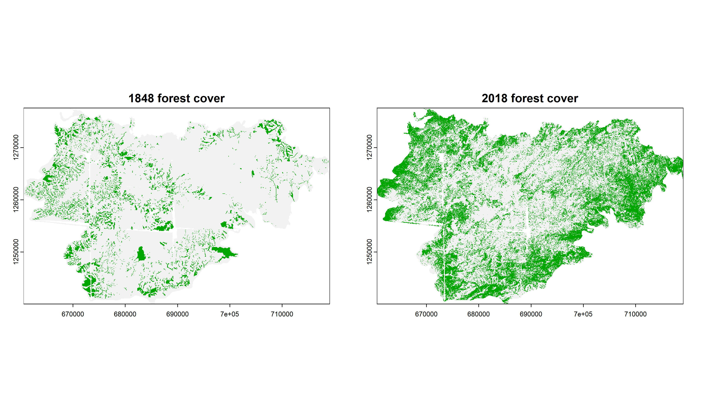
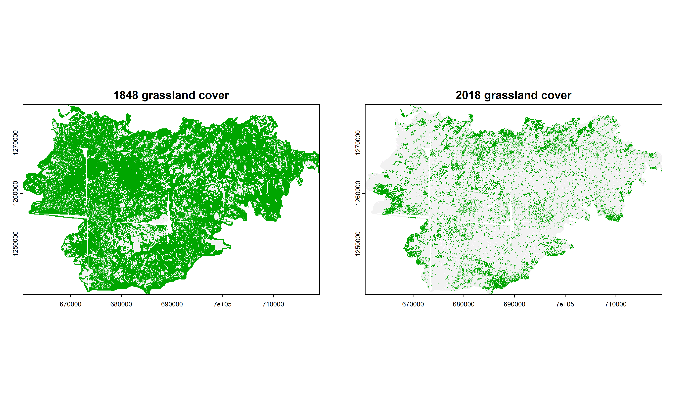
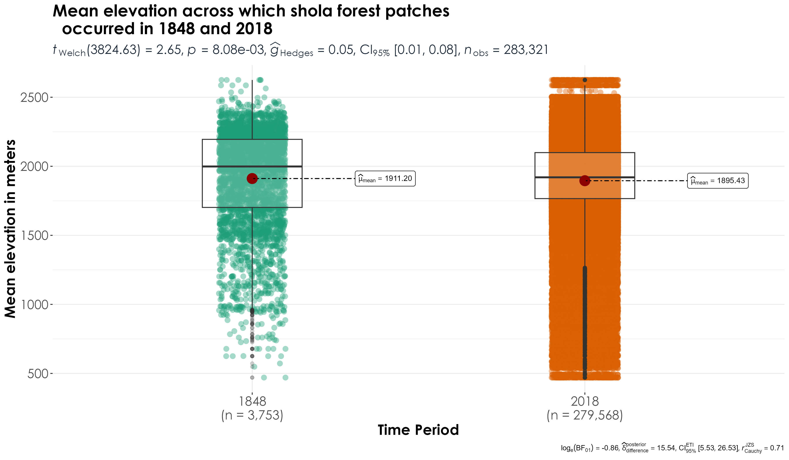
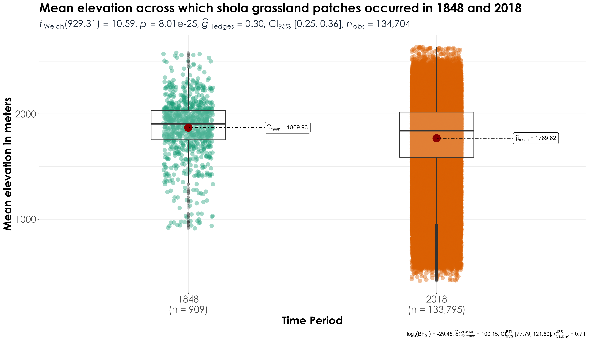

# Grassland contractions & forest expansions

In the previous script, we inferred that grasslands have contracted dramatically, plantations have increased drastically and forests have expanded as well. In this script, we will compare and contrasts areas where forests and plantations have increased over time and if these areas overlap with grassland habitats (in the past).

## Load necessary libraries

```{r}
library(sf)
library(raster)
library(terra)
library(dplyr)
library(tidyverse)
library(mapview)
library(scico)
library(extrafont)
library(ggstatsplot)
```

## Load processed land cover rasters
```{r}
rast1848 <- terra::rast("results/landcover/1848.tif")
rast2018 <- terra::rast("results/landcover/2018reclassified.tif")
```

## Visualize forests across the two time periods

```{r}
## saving a high resolution visualization
png(filename = "figs/fig_forests_1848_vs_2018.png", 
    width = 12, height = 7, units = "in", res = 300)

par(mfrow = c(1,2))
plot(rast1848 == "shola_forest", 
     main = "1848 forest cover",
     legend = FALSE)
plot(rast2018 == "shola_forest", 
     main = "2018 forest cover", 
     legend=FALSE)
dev.off()
```



## Visualize grassland area across the two time periods

```{r}
## saving a high resolution visualization
png(filename = "figs/fig_grasslands_1848_vs_2018.png", 
    width = 12, height = 7, units = "in", res = 300)

par(mfrow = c(1,2))
plot(rast1848 == "shola_grassland",
     main = "1848 grassland cover",
     legend = FALSE)
plot(rast2018 == "shola_grassland", 
     main = "2018 grassland cover", 
     legend=FALSE)
dev.off()
```



## Comparing if forests have increased in locations where grasslands were formerly found?

```{r}
# first, we will polygonize the rasters 
vect1848 <- st_as_sf(as.polygons(rast1848))
vect2018 <- st_as_sf(as.polygons(rast2018))

# add a year column to the polygons
vect1848$year <- "1848"
vect2018$year <- "2018"

# overlay shola_forests from 2018 over shola_grasslands from 1848

# first, we will interactively view the visualization
grass1848 <- mapview(vect1848[vect1848$name == "shola_grassland",], col.regions = '#cbb315')
for2018 <- mapview(vect2018[vect2018$name == "shola_forest",], col.regions = '#04a310', 
                   alpha.regions = 0.5)
map_vis <- grass1848+for2018

## save the interactive visualization
html_fl <- tempfile(tmpdir = getwd(), fileext = ".html")
# create standalone .html
mapview::mapshot(map_vis, url = html_fl)

# clearly the above analyses reveals that large number of areas that were formerly grasslands in 1848 are now forests in 2018. 

# producing a static visualization
grass1848 <- vect1848[vect1848$name=="shola_grassland",]
for2018 <- vect2018[vect2018$name=="shola_forest",]

fig_for2018_grass1848 <- ggplot() +
  geom_sf(data = grass1848, fill = '#cbb315') +
  geom_sf(data = for2018, fill = '#04a310') +
  facet_wrap(name~year) +
  theme_bw() +
  theme(text = element_text(size=14,  family="Century Gothic"),
    axis.title = element_text(
      family = "Century Gothic",
      size = 14, face = "bold"),
    axis.text = element_text(family = "Century Gothic", 
                             size = 14),
    axis.text.x = element_text(angle = 90, vjust = 0.5, 
                               hjust = 1),
    legend.position = "none")

ggsave(fig_for2018_grass1848,
  filename = "figs/fig_forests2018_vs_grasslands1848.png", width = 22, height = 8, device = png(), units = "in", dpi = 600)
dev.off()
```


## Have forests expanded across elevations? 

In the above visualizations, we observed that forests have expanded across areas that were formerly grasslands. We ask if these expansions vary as a function of elevation. In other words, are forests expanding upslope?
```{r}
# add elevation raster
# adding a higher resolution DEM from ALOS
alt <- rast("data/elevation/alos-elevation-30m.tif") # this layer is not added to github as a result of its large size and can be downloaded from SRTM (Farr et al. (2007))

# use shapefile to crop the elevation raster
outline <- st_transform(vect1848, 4326)
alt.hills <- terra::crop(alt, outline)

# transform to wgs84 to extract elev
vect1848poly <- st_transform(vect1848,4326)
vect2018poly <- st_transform(vect2018, 4326)

## convert data from multipolygon to polygon
vect1848poly <- st_cast(vect1848poly, "POLYGON")
vect2018poly <- st_cast(vect2018poly, "POLYGON")

# extract values from that raster (note: transformation of coordinate system)
# we will extract minimum, mean and maximum elevation from polygon objects

# for 1848 data
elevMin <- terra::extract(alt.hills, vect1848poly,
                        fun = min, na.rm = T)
elevMean <- terra::extract(alt.hills, vect1848poly,
                        fun = mean, na.rm = TRUE)
elevMax <- terra::extract(alt.hills, vect1848poly,
                        fun = max, na.rm = TRUE)
names(elevMin) <- c("ID","elevMin")
names(elevMean) <- c("ID","elevMean")
names(elevMax) <- c("ID","elevMax")

vect1848poly <- cbind(vect1848poly, elevMin[,-1],
                      elevMean[,-1], elevMax[,-1])
names(vect1848poly) <- c("name","year","elevMin",
                         "elevMean","elevMax","geometry")

# for 2018 data 
# please note: despite using terra functions, the following lines of code take ~ 3-5 minutes of time
elevMin <- terra::extract(alt.hills, vect2018poly,
                        fun = min, na.rm = TRUE)
elevMean <- terra::extract(alt.hills, vect2018poly,
                        fun = mean, na.rm = TRUE)
elevMax <- raster::extract(alt.hills, vect2018poly,
                        fun = max, na.rm = TRUE)
names(elevMin) <- c("ID","elevMin")
names(elevMean) <- c("ID","elevMean")
names(elevMax) <- c("ID","elevMax")

vect2018poly <- cbind(vect2018poly, elevMin[,-1],
                      elevMean[,-1], elevMax[,-1])
names(vect2018poly) <- c("name","year","elevMin",
                         "elevMean","elevMax","geometry")

# visualization 
gc()
elev1848 <- vect1848poly %>% st_drop_geometry()
elev2018 <- vect2018poly %>% st_drop_geometry()

data_for_plotting <- bind_rows(elev1848,
                               elev2018)
write.csv(data_for_plotting, "results/elevation-landCover-overTime.csv",
          row.names = F
)

# get only forest data
data_forest <- data_for_plotting %>%
  filter(name == "shola_forest")

# has minimum elevation increased over time?
fig_forest_minElev <- ggbetweenstats(
  data = data_forest,
  x = year,
  y = elevMin,
  xlab = "Time Period", 
  ylab = "Minimum elevation in meters",
  title = "Minimum elevation across which shola forest patches
  occurred in 1848 and 2018",
  plot.type = "box",
  pairwise.comparisons = T) +
 theme(plot.title = element_text(family = "Century Gothic",
      size = 18, face = "bold"),
    axis.title = element_text(family = "Century Gothic",
      size = 16, face = "bold"),
        axis.text = element_text(family="Century Gothic",
                                 size = 14),
      plot.subtitle = element_text(
      family = "Century Gothic", 
      size = 14, 
      face = "bold",
      color="#1b2838"
    ))

ggsave(fig_forest_minElev, filename = "figs/fig_sholaForests_minimumElevation.png", width = 12, height = 7, device = png(), units = "in", dpi = 300)
dev.off()

# has mean elevation increased over time?
fig_forest_meanElev <- ggbetweenstats(
  data = data_forest,
  x = year,
  y = elevMean,
  xlab = "Time Period", 
  ylab = "Mean elevation in meters",
  title = "Mean elevation across which shola forest patches occurred in 1848 and 2018",
  plot.type = "box",
  pairwise.comparisons = T) +
 theme(plot.title = element_text(family = "Century Gothic",
      size = 18, face = "bold"),
    axis.title = element_text(family = "Century Gothic",
      size = 16, face = "bold"),
        axis.text = element_text(family="Century Gothic",
                                 size = 14),
      plot.subtitle = element_text(
      family = "Century Gothic", 
      size = 14, 
      face = "bold",
      color="#1b2838"
    ))

ggsave(fig_forest_meanElev, filename = "figs/fig_sholaForests_meanElevation.png", width = 12, height = 7, device = png(), units = "in", dpi = 300)
dev.off()

## significant differences were observed in mean elevation across time periods, with mean elevation of shola forests being significantly lower in modern time periods compared to historical time periods

fig_forest_maxElev <- ggbetweenstats(
  data = data_forest,
  x = year,
  y = elevMax,
  xlab = "Time Period", 
  ylab = "Max elevation in meters",
  title = "Max elevation across which shola forest patches occurred in 1848 and 2018",
  plot.type = "box",
  pairwise.comparisons = T) +
 theme(plot.title = element_text(family = "Century Gothic",
      size = 18, face = "bold"),
    axis.title = element_text(family = "Century Gothic",
      size = 16, face = "bold"),
        axis.text = element_text(family="Century Gothic",
                                 size = 14),
      plot.subtitle = element_text(
      family = "Century Gothic", 
      size = 14, 
      face = "bold",
      color="#1b2838"
    ))

ggsave(fig_forest_maxElev, filename = "figs/fig_sholaForests_maxElevation.png", width = 12, height = 7, device = png(), units = "in", dpi = 300)
dev.off()
```



## How do grassland patches vary by elevation across time periods?
```{r}
data_grassland <-data_for_plotting %>% # get only grasslands
  filter(name == "shola_grassland")

# has minimum elevation increased over time?
fig_grassland_minElev <- ggbetweenstats(
  data = data_grassland,
  x = year,
  y = elevMin,
  xlab = "Time Period", 
  ylab = "Minimum elevation in meters",
  title = "Minimum elevation across which shola grassland patches occurred in 1848 and 2018",
  plot.type = "box",
  pairwise.comparisons = T) +
 theme(plot.title = element_text(family = "Century Gothic",
      size = 18, face = "bold"),
    axis.title = element_text(family = "Century Gothic",
      size = 16, face = "bold"),
        axis.text = element_text(family="Century Gothic",
                                 size = 14),
      plot.subtitle = element_text(
      family = "Century Gothic", 
      size = 14, 
      face = "bold",
      color="#1b2838"
    ))

ggsave(fig_grassland_minElev, filename = "figs/fig_sholaGrasslands_minimumElevation.png", width = 12, height = 7, device = png(), units = "in", dpi = 300)
dev.off()

# has mean elevation increased over time?
fig_grassland_meanElev <- ggbetweenstats(
  data = data_grassland,
  x = year,
  y = elevMean,
  xlab = "Time Period", 
  ylab = "Mean elevation in meters",
  title = "Mean elevation across which shola grassland patches occurred in 1848 and 2018",
  plot.type = "box",
  pairwise.comparisons = T) +
 theme(plot.title = element_text(family = "Century Gothic",
      size = 18, face = "bold"),
    axis.title = element_text(family = "Century Gothic",
      size = 16, face = "bold"),
        axis.text = element_text(family="Century Gothic",
                                 size = 14),
      plot.subtitle = element_text(
      family = "Century Gothic", 
      size = 14, 
      face = "bold",
      color="#1b2838"
    ))

ggsave(fig_grassland_meanElev, filename = "figs/fig_sholaGrasslands_meanElevation.png", width = 12, height = 7, device = png(), units = "in", dpi = 300)
dev.off()

fig_grassland_maxElev <- ggbetweenstats(
  data = data_grassland,
  x = year,
  y = elevMax,
  xlab = "Time Period", 
  ylab = "Max elevation in meters",
  title = "Max elevation across which shola grassland patches occurred in 1848 and 2018",
  plot.type = "box",
  pairwise.comparisons = T) +
 theme(plot.title = element_text(family = "Century Gothic",
      size = 18, face = "bold"),
    axis.title = element_text(family = "Century Gothic",
      size = 16, face = "bold"),
        axis.text = element_text(family="Century Gothic",
                                 size = 14),
      plot.subtitle = element_text(
      family = "Century Gothic", 
      size = 14, 
      face = "bold",
      color="#1b2838"
    ))

ggsave(fig_grassland_maxElev, filename = "figs/fig_sholaGrasslands_maxElevation.png", width = 12, height = 7, device = png(), units = "in", dpi = 300)
dev.off()
```



## Comparing if plantations have increased in locations where grasslands were formerly found?
```{r}
# overlay plantations from 2018 over shola_grasslands from 1848

# first, we will interactively view the visualization
grass1848 <- mapview(vect1848[vect1848$name == "shola_grassland",], col.regions = '#cbb315')
plant2018 <- mapview(vect2018[vect2018$name == "plantations",], col.regions = '#c17111', alpha.regions = 0.5)
map_vis <- grass1848+plant2018

## save the interactive visualization
html_fl <- tempfile(tmpdir = getwd(), fileext = ".html")
# create standalone .html
mapview::mapshot(map_vis, url = html_fl)

# producing a static visualization
grass1848 <- vect1848[vect1848$name=="shola_grassland",]
plant2018 <- vect2018[vect2018$name=="plantations",]

fig_plant2018_grass1848 <- ggplot() +
  geom_sf(data = grass1848, fill = '#cbb315') +
  geom_sf(data = plant2018, fill = '#c17111') +
  facet_wrap(name~year) +
  theme_bw() +
  theme(text = element_text(size=14,  family="Century Gothic"),
    axis.title = element_text(
      family = "Century Gothic",
      size = 14, face = "bold"),
    axis.text = element_text(family = "Century Gothic", 
                             size = 14),
    axis.text.x = element_text(angle = 90, vjust = 0.5, 
                               hjust = 1),
    legend.position = "none")

ggsave(fig_plant2018_grass1848,
  filename = "figs/fig_plantations2018_vs_grasslands1848.png", width = 22, height = 8, device = png(), units = "in", dpi = 600)
dev.off()
```


Interactive visualizations of forests in 2018 and grasslands in 1848 can be accessed via Zenodo (the files are very large for a GitHub upload). 

