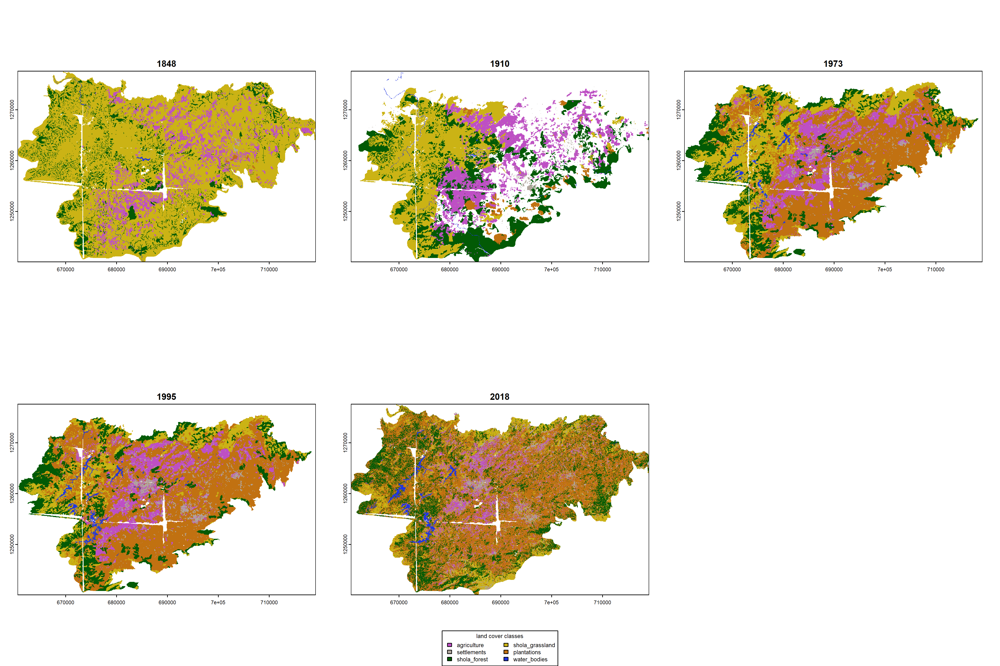

# Visualizing time series of change  

From our previous visualizations, one could potentially attribute changes in grassland area in 2018 to expansion of forests and plantations over time. However, our interpretations are restricted to simply two time points over time. Here, we include the addition of data from three intermediate time periods: 1910 (Survey of India map that is partially digitized), 1973 and 1995 (the latter two are published maps from @arasumani2019). 

## Load necessary libraries
```{r}
library(sf)
library(raster)
library(terra)
library(stars)
library(dplyr)
library(tidyverse)
library(mapview)
library(landscapemetrics)
library(scico)
library(extrafont)
```

## Load processed land cover rasters
```{r}
rast1848 <- terra::rast("results/landcover/1848.tif")
rast2018 <- terra::rast("results/landcover/2018.tif")
```

## Loading data from the 1910 map
```{r}
# list all shapefiles in the directory
nil1910 <- list.files("data/landcover/1910-nilgiris/", full.names = T, recursive = T, pattern=".shp$")

# create vector files
ag1910 <- st_read(nil1910[1]) # type: multipolygon
plantations1910 <- st_read(nil1910[2]) # type: multipolygon; 1 empty geometry
settlements1910 <- st_read(nil1910[3]) # type: polygon
sholaForest1910 <- st_read(nil1910[4]) # type: multipolygon
sholaGrassland1910 <- st_read(nil1910[5]) # type: multipolygon
waterBodies1910 <- st_read(nil1910[6]) # type: polygon

# explore and fix any issues with the above vector files
# we need to ensure consistency across files for the sake of merging them into a single geometry collection

# we notice a range of small issues with the shapefiles above
# the geometry type is variable and needs to be consistent
# empty geometries need to be removed
# attribute names need to be consistent across shapefiles

# first, we will remove empty geometries
plantations1910 <- plantations1910[!st_is_empty(plantations1910),]

# fixing attribute tables to ensure they are consistent across shapefiles
ag1910 <- ag1910[,-3]
plantations1910 <- plantations1910[,-3]
settlements1910 <- settlements1910[,-3]
sholaForest1910 <- sholaForest1910[,-3]
sholaGrassland1910 <- sholaGrassland1910[,-3]
waterBodies1910 <- waterBodies1910[,-3]

names(ag1910) <- c("id", "name","geometry")
ag1910$name <- "agriculture"
names(plantations1910) <- c("id", "name","geometry")
plantations1910$name <- "plantations"
names(settlements1910) <- c("id", "name","geometry")
settlements1910$name <- "settlements"
names(sholaForest1910) <- c("id", "name","geometry")
sholaForest1910$name <- "shola_forest"
names(sholaGrassland1910) <- c("id", "name","geometry")
sholaGrassland1910$name <- "shola_grassland"
names(waterBodies1910) <- c("id", "name","geometry")
waterBodies1910$name <- "water_bodies"

# transform to UTM 43N
ag1910 <- st_transform(ag1910, 32643)
plantations1910 <- st_transform(plantations1910, 32643)
settlements1910 <- st_transform(settlements1910, 32643)
sholaForest1910 <- st_transform(sholaForest1910, 32643)
sholaGrassland1910 <- st_transform(sholaGrassland1910, 32643)
waterBodies1910 <- st_transform(waterBodies1910, 32643)

# creating a single simple feature collection
nil1910 <- rbind(ag1910, plantations1910, settlements1910,sholaForest1910, sholaGrassland1910,waterBodies1910)
```

## Rasterizing of the 1910 data
```{r}
# rasterize
# the scale of the map is 1:63360 ~30 m pixel size for rasterization
vect1910 <- terra::vect(nil1910)
emptyRast <- terra::rast(res = 30, xmin = 656316.3, xmax = 726964.6, ymin = 1229234, ymax = 1281983, crs = "+proj=utm +zone=43 +datum=WGS84 +units=m +no_defs")
rast1910 <- terra::rasterize(vect1910, emptyRast, "name")

## we need to mask the raster with the 1848 raster
## we use terra::mask as there are empty/no_data values in 1848

## prior to masking, we need to crop and reset extents 
## note, we are resetting the extent to match the 1848 raster
rast1910 <- crop(rast1910, rast1848)

## extents still do not match for masking
## force set extents
ext(rast1910) <- c(660555.3, 719133.3, 1240050, 1277598)

## We have one other issue to tackle before we mask
## The nrow and ncols do not match because of differences in spatial res

## resample the 1848 and the 2018 rasters to the 1910 rasters to match spatial resolution
## The 1848 raster and 2018 rasters is at 10 m resolution
rast1848 <- resample(rast1848, rast1910, method = "near")
rast2018 <- resample(rast2018, rast1910, method = "near")

## masking the 1910 raster with the 1848 raster
rast1910 <- mask(rast1910, rast1848)

## convert the raster to a categorical raster
rast1910 <- as.factor(rast1910)

## create a dataframe with names of classes and their corresponding values
landcover_reclass <- data.frame(ID = 0:5,
                              name = c("agriculture",                                                        "plantations",
                                  "settlements",
                                  "shola_forest",
                                  "shola_grassland",
                                  "water_bodies"))

levels(rast1910) <- landcover_reclass
```

## Loading the 1973 and 1995 data
```{r}
# load the 1973 and 1995 shapefiles
nil1973 <- st_read("data/landcover/1973-nilgiris/1973.shp")
nil1995 <- st_read("data/landcover/1995-nilgiris/1995.shp")

# Let's first add class name to nil1973 shapefile
nil1973 <- nil1973 %>%
  mutate(name = case_when(
    gridcode == 1 ~ "shola_grassland",
    gridcode == 2 ~ "shola_forest",
    gridcode == 3 ~ "timber_plantations",
    gridcode == 4 ~ "tea_plantations",
    gridcode == 5 ~ "ochlandra",
    gridcode == 6 ~ "settlements",
    gridcode == 7 ~ "agriculture",
    gridcode == 8 ~ "water_bodies"
  ))

# Let's add class name to nil1995 shapefile
nil1995 <- nil1995 %>%
  mutate(name = case_when(
    gridcode == 1 ~ "shola_grassland",
    gridcode == 2 ~ "shola_forest",
    gridcode == 3 ~ "timber_plantations",
    gridcode == 4 ~ "tea_plantations",
    gridcode == 5 ~ "ochlandra",
    gridcode == 6 ~ "settlements",
    gridcode == 7 ~ "agriculture",
    gridcode == 8 ~ "water_bodies"
  ))

# renaming for ease of visualization
names(nil1973) <- c("id","area","geometry","name")
names(nil1995) <- c("id","area","geometry","name")
```

## Rasterization of the 1973 and 1995 data
```{r}
# rasterize
vect1973 <- terra::vect(nil1973)
emptyRast <- terra::rast(res = 30, xmin = 517079.8, xmax = 794369.8, ymin = 922564.6, ymax = 1500035, crs = "+proj=utm +zone=43 +datum=WGS84 +units=m +no_defs")
rast1973 <- terra::rasterize(vect1973, emptyRast, "name")

## crop and mask to the 1848 raster
rast1973 <- crop(rast1973, rast1848)

## extents still do not match for masking
## force set extents
ext(rast1973) <- c(660555.3, 719133.3, 1240050, 1277598)

## resample the 1848, 1910 & 2018 rasters to the 1973 rasters to match spatial resolution
rast1848 <- resample(rast1848, rast1973, method = "near")
rast1910 <- resample(rast1910, rast1973, method = "near")
rast2018 <- resample(rast2018, rast1973, method = "near")

## masking the 1973 raster with the 1848 raster
rast1973 <- mask(rast1973, rast1848)

## convert the raster to a categorical raster
rast1973 <- as.factor(rast1973)

## create a dataframe with names of classes and their corresponding values
landcover_class <- data.frame(ID = c(0,2:7),
                              name = c("agriculture",
                                       "settlements",
                                        "shola_forest",
                                    "shola_grassland",
                                    "tea_plantations",
                                  "timber_plantations",
                                      "water_bodies"))

levels(rast1973) <- landcover_class

# repeating process for 1995 data
# note that the spatial resolution of Landsat TM is at 30 m spatial resolution
vect1995 <- terra::vect(nil1995)
emptyRast <- terra::rast(res = 30, xmin = 517079.8, xmax = 794369.8, ymin = 922564.6, ymax = 1500035, crs = "+proj=utm +zone=43 +datum=WGS84 +units=m +no_defs")
rast1995 <- terra::rasterize(vect1995, emptyRast, "name")

## crop and mask to the 1848 raster
rast1995 <- crop(rast1995, rast1848)

## extents still do not match for masking
## force set extents
ext(rast1995) <- c(660555.3, 719133.3, 1240050, 1277598)

# resample raster from 1995 to match resolution of 1973 raster
rast1995 <- resample(rast1995, rast1973, method = "near")

## masking the 1995 raster with the 1848 raster
rast1995 <- mask(rast1995, rast1848)

## convert the raster to a categorical raster
rast1995 <- as.factor(rast1995)

levels(rast1995) <- landcover_class
```

## Visualization of landscape change over time

```{r}
## side-by-side visualization
colors1848 <- c(
  '#be4fc4', # agriculture, violetish
  '#c17111', # plantations, brownish
  '#b0a69d', # settlements, grayish
  '#025a05', # shola forests, dark green
  '#cbb315', # shola grasslands, yellowish
  '#2035df'  # waterbodies, royal blue
)

colors1973 <- c(
  '#be4fc4', # agriculture, violetish
  '#b0a69d', # settlements, grayish
  '#025a05', # shola forests, dark green
  '#cbb315', # shola grasslands, yellowish
  '#04a310', # tea plantations, light green
  '#c17111', # timber plantations, brownish
  '#2035df'  # waterbodies, royal blue
)

colors2018 <- c(
  '#be4fc4', # agriculture, violetish
 '#025a05', # shola forests, dark green
  '#cbb315', # shola grasslands, yellowish
  '#c17111', # timber plantations, brownish
  '#b0a69d', # settlements, grayish
 '#04a310', # tea plantations, light green
  '#2035df'  # waterbodies, royal blue
)

## saving a high resolution visualization
png(filename = "figs/fig_landCover_timeSeries.png", 
    width = 15, height = 10, units = "in", res = 300)

par(mfrow = c(2,3))
plot(rast1848, col = colors1848, main = "1848",
     legend = FALSE)
plot(rast1910, col = colors1848, main = "1910",
     legend = FALSE)
plot(rast1973, col = colors1973, main = "1973",
     legend = FALSE)
plot(rast1995, col = colors1973, main = "1995",
     legend = FALSE)
plot(rast2018, col=colors2018, main = "2018", 
     legend=FALSE)

# add custom legend
par(mar = c(0, 0, 0, 0), 
     new = TRUE)
plot(0, 0, type = 'l', bty = 'n', xaxt = 'n', yaxt = 'n')
legend("bottom",
       legend=landcover_class$name, fill=colors1973, 
       cex = 0.8, 
       title="land cover classes",
       ncol = 2)
dev.off()
```


## Subsume plantations into one category for 1973, 1995, and 2018

Since 1848 had very few to no tea plantations and only timber plantations were present at the time, we reclassify timber plantations into the plantations category for the 1973, 1995 and 2018 rasters to ease comparisons. 
```{r}
# load existing reclassified 2018 raster
rast2018 <- terra::rast("results/landcover/2018reclassified.tif")
rast2018 <- resample(rast2018, rast1973, method = "near")

# read reclassification matrix
reclassification_matrix <- read.csv("data/landcover/1973-nilgiris/reclassification-matrix.csv")
reclassification_matrix <- as.matrix(reclassification_matrix[, c("V1", "To")])

# reclassification
rast1973_reclassified <- terra::classify(
  x = rast1973,
  rcl = reclassification_matrix
)
rast1995_reclassified <- terra::classify(
  x = rast1995,
  rcl = reclassification_matrix
)

## create a dataframe with names of classes and their corresponding values
landcover_reclass <- data.frame(ID = 1:6,
                              name = c("agriculture", 
                                       "settlements",
                                       "shola_forest",
                                   "shola_grassland",
                                      "plantations",
                                      "water_bodies"))

levels(rast1973_reclassified) <- landcover_reclass
levels(rast1995_reclassified) <- landcover_reclass

## side-by-side visualization
colors1973reclass <- c(
  '#be4fc4', # agriculture, violetish
  '#b0a69d', # settlements, grayish
  '#025a05', # shola forests, dark green
  '#cbb315', # shola grasslands, yellowish
  '#c17111', # plantations, brownish
  '#2035df'  # waterbodies, royal blue
)

colors2018reclass <- c(
  '#be4fc4', # agriculture, violetish
  '#025a05', # shola forests, dark green
  '#cbb315', # shola grasslands, yellowish
  '#c17111', # plantations, brownish
  '#b0a69d', # settlements, grayish
  '#2035df'  # waterbodies, royal blue
)

## saving a high resolution visualization
png(filename = "figs/fig_landCover_timeSeries_reclassified.png", 
    width = 15, height = 10, units = "in", res = 300)

par(mfrow = c(2,3))
plot(rast1848, col = colors1848, main = "1848",
     legend = FALSE)
plot(rast1910, col = colors1848, main = "1910",
     legend = FALSE)
plot(rast1973_reclassified, col = colors1973reclass, main = "1973",legend = FALSE)
plot(rast1995_reclassified, col = colors1973reclass, main = "1995",legend = FALSE)
plot(rast2018, col=colors2018reclass, main = "2018", 
     legend=FALSE)

# add custom legend
par(mar = c(0, 0, 0, 0), 
     new = TRUE)
plot(0, 0, type = 'l', bty = 'n', xaxt = 'n', yaxt = 'n')
legend("bottom",
       legend=landcover_reclass$name,
       fill=colors1973reclass, 
       cex = 0.8, 
       title="land cover classes",
       ncol = 2)
dev.off()
```



## Creating smaller regions of interest for comparison

While comparing a time series of landscape change shows how different land cover types have expanded or contracted over time, the broader regions of interest are slightly different across time periods. Here, I subset rasters by cropping smaller extents, prior to visualization.
```{r}
## south-western quadrant
sw1848 <- crop(rast1848, c(666000,675000,
                        1240050,1255000))
sw1910 <- crop(rast1910, c(666000,675000,
                        1240050,1255000))
sw1973 <- crop(rast1973_reclassified, c(666000,675000,
                        1240050,1255000))
sw1995 <- crop(rast1995_reclassified, c(666000,675000,
                        1240050,1255000))
sw2018 <- crop(rast2018, c(666000,675000,
                        1240050,1255000))

## saving a high resolution visualization
png(filename = "figs/fig_landCover_timeSeries_southWesternRegion.png",
    width = 15, height = 10, units = "in", res = 300)

par(mfrow = c(2,3))
plot(sw1848, col = c('#be4fc4', # agriculture, violetish
  '#b0a69d', # settlements, grayish
  '#025a05', # shola forests, dark green
  '#cbb315', # shola grasslands, yellowish
  '#2035df'  # waterbodies, royal blue
),main = "1848", legend = FALSE)
plot(sw1910, col = c(
  '#b0a69d', # settlements, grayish
  '#025a05', # shola forests, dark green
  '#cbb315', # shola grasslands, yellowish
  '#2035df'  # waterbodies, royal blue
), main = "1910", legend = FALSE)
plot(sw1973, col = c('#be4fc4', # agriculture, violetish
  '#025a05', # shola forests, dark green
  '#cbb315', # shola grasslands, yellowish
  '#c17111', # plantations, brownish
  '#2035df'  # waterbodies, royal blue
), main = "1973",legend = FALSE)
plot(sw1995, col = c('#be4fc4', # agriculture, violetish
                     '#b0a69d', # settlements, grayish
   '#025a05', # shola forests, dark green
  '#cbb315', # shola grasslands, yellowish
  '#c17111', # plantations, brownish
  '#2035df'  # waterbodies, royal blue
), main = "1995",legend = FALSE)
plot(sw2018, col=colors2018reclass, main = "2018", 
     legend=FALSE)

# add custom legend
par(mar = c(0, 0, 0, 0), 
     new = TRUE)
plot(0, 0, type = 'l', bty = 'n', xaxt = 'n', yaxt = 'n')
legend("bottom",
       legend=landcover_reclass$name,
       fill=colors1973reclass, 
       cex = 0.8, 
       title="land cover classes",
       ncol = 2)
dev.off()

# western quadrant
w1848 <- crop(rast1848, c(665000,680000,
                        1255000,1265000))
w1910 <- crop(rast1910, c(665000,680000,
                        1255000,1265000))
w1973 <- crop(rast1973_reclassified, c(665000,680000,
                        1255000,1265000))
w1995 <- crop(rast1995_reclassified, c(665000,680000,
                        1255000,1265000))
w2018 <- crop(rast2018, c(665000,680000,
                        1255000,1265000))

## saving a high resolution visualization
png(filename = "figs/fig_landCover_timeSeries_westernRegion.png",
    width = 15, height = 10, units = "in", res = 300)

par(mfrow = c(2,3))
plot(w1848, col = c('#be4fc4', # agriculture, violetish
   '#025a05', # shola forests, dark green
  '#cbb315' # shola grasslands, yellowish
),main = "1848", legend = FALSE)
plot(w1910, col = c(
  '#be4fc4',
  '#b0a69d', # settlements, grayish
  '#025a05', # shola forests, dark green
  '#cbb315', # shola grasslands, yellowish
  '#2035df'  # waterbodies, royal blue
), main = "1910", legend = FALSE)
plot(w1973, col = colors1973reclass, main = "1973",legend = FALSE)
plot(w1995, col = colors1973reclass, main = "1995",legend = FALSE)
plot(w2018, col=colors2018reclass, main = "2018", 
     legend=FALSE)

# add custom legend
par(mar = c(0, 0, 0, 0), 
     new = TRUE)
plot(0, 0, type = 'l', bty = 'n', xaxt = 'n', yaxt = 'n')
legend("bottom",
       legend=landcover_reclass$name,
       fill=colors1973reclass, 
       cex = 0.8, 
       title="land cover classes",
       ncol = 2)
dev.off()
```


## Comparisons only above 1400 meters in elevation 

Here, we use the 1973/1995 raster as masks to restrict region of comparisons to only above 1400 meters in elevation
```{r}
# creating high elevation rasters/regions of interest
rast1848high <- mask(rast1848, rast1973_reclassified)
rast1910high <- mask(rast1910, rast1973_reclassified)
rast2018high <- mask(rast2018, rast1973_reclassified)

## saving a high resolution visualization
png(filename = "figs/fig_landCover_timeSeries_above1400meters.png",
    width = 15, height = 10, units = "in", res = 300)

par(mfrow = c(2,3))
plot(rast1848high, col = colors1848, 
     main = "1848", legend = FALSE)
plot(rast1910high, col = colors1848, 
     main = "1910", legend = FALSE)
plot(rast1973_reclassified, col = colors1973reclass, main = "1973",legend = FALSE)
plot(rast1995_reclassified, col = colors1973reclass, main = "1995",legend = FALSE)
plot(rast2018high, col=colors2018reclass, main = "2018", legend=FALSE)

# add custom legend
par(mar = c(0, 0, 0, 0), 
     new = TRUE)
plot(0, 0, type = 'l', bty = 'n', xaxt = 'n', yaxt = 'n')
legend("bottom",
       legend=landcover_reclass$name,
       fill=colors1973reclass, 
       cex = 0.8, 
       title="land cover classes",
       ncol = 2)
dev.off()
```

