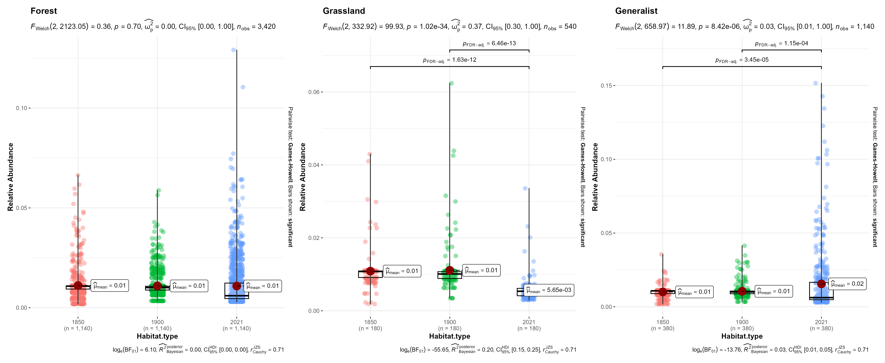
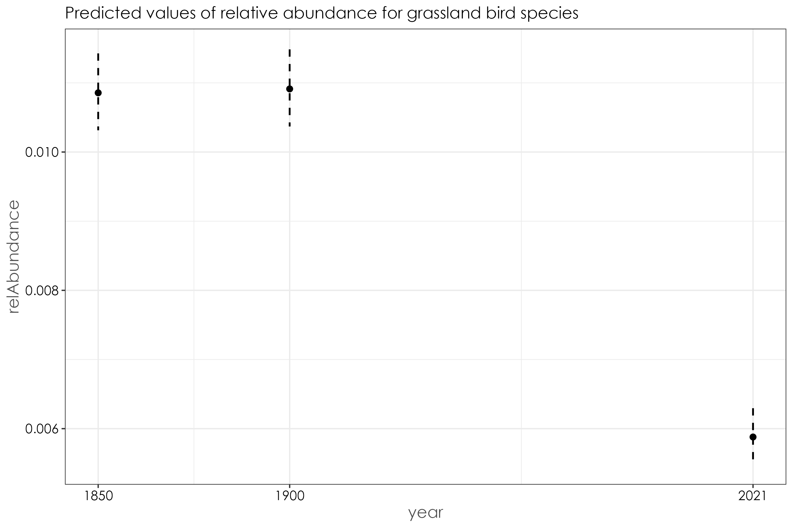

# Examining changes in relative abundance over time as a function of species habitat affiliation  

In this script, we will examine how relative abundance varies as a function of habitat affiliation across time periods for bird communities. We will plot species rank abundances of relative abundance to estimate how values of relative abundance has shifted for each species. In addition, we will run beta regressions to test for significance in relative abundance changes over time. 

## Load necessary libraries
```{r}
library(dplyr)
library(stringr)
library(tidyverse)
library(scico)
library(RColorBrewer)
library(extrafont)
library(sf)
library(raster)
library(lattice)
library(data.table)
library(ggrepel)
library(report)
library(lme4)
library(glmmTMB)
library(multcomp)
library(ggstatsplot)
library(paletteer)
library(ggpubr)
library(goeveg)
library(betareg)
library(ggeffects)
library(patchwork)
```

## Load data on species relative abundances
```{r}
relAbun <- read.csv("results/species-relative-abundance.csv")
names(relAbun) <- c("common_name","1850-1900","1900-1950","2021")
```

## Load species trait data  
```{r}
## load in species trait dataset
trait_dat <- read.csv("data/species-trait-dat.csv")

# note: the classification of habitat type was created by comparing habitat affiliation data from the State of India's Birds report (v2; released in 2023). 
# this classification was also vetted independently by two reviewers.
# We used the following trait classifications:
# Forest 
# Grassland 
# Generalist

# Our criteria for each of these classifications includes the following: 
# In the 1850s, the land cover change analysis revealed that the majority of the landscape was largely grasslands and forests. However in 2018, the landscape is largely a mosaic of human-modified land cover types - including wooded habitats (mostly comprising timber plantations and degraded forests), tea plantations, followed by forests and grasslands.
# While the State of India's Birds provides a habitat classification/criteria based on contemporary use of habitats by a species, we classified species based on our resurveys and assuming that a species would either be in a forest affiliated bird species, grassland species or a generalist species in the 1850s. 
# An example in this case is the black and orange flycatcher. While it is commonly found in shola forest habitat, this species is also common in degraded wooded areas, including timber plantations today. However, historically, in the 1850s (due to limited presence of timber plantations compared to 2018), we assume that this is a forest specialist bird as no other wooded habitats apart from forests existed (predominantly) in the 1850s (See 06_land-cover-classification.Rmd)
# Other examples include bird species that prefer open habitats, scrubland and dry grassland - such species have been lumped into the Grassland category as this was the closest habitat similar to the above habitat types in 1850s. Eg. Blue-tailed bee-eater, long-tailed shrike, black-winged kite. 
# If a species is truly a generalist species and is not particularly occupying/specialized on any particular  forested/wooded/grassland habitat, it was classified in the generalist category

## join overall relative abundance dataframe and species trait data 
rel_abun_trait <- relAbun %>%
  pivot_longer(-common_name, names_to = "time_period", values_to = "relative_abundance") %>% left_join(., trait_dat, by=c("common_name"="common_name")) %>%
   filter(Habitat.type != "Wetland") %>% # remove wetland birds
  ungroup()

# count distinct number of species affiliated with a particular habitat type
spCount <- rel_abun_trait[,c(1,7)] %>%
  distinct() %>%
  group_by(Habitat.type) %>%
  count()

# Based on the above criteria, 57 species were classified as forest birds, 9 species were classified as grassland birds, 19 species were classified as generalist species.  

# visualization by habitat affiliation
rel_abun_trait$Habitat.type <- factor(rel_abun_trait$Habitat.type, levels=c("Forest", "Grassland", "Generalist"))

fig_relAbun_habitat <- grouped_ggbetweenstats(
  data = rel_abun_trait,
  x = time_period,
  y = relative_abundance,
  grouping.var = `Habitat.type`,
  xlab = "Habitat.type", 
  ylab = "Relative Abundance",
  p.adjust.method = "fdr",
  violin.args = list(width = 0)) +
  scale_fill_scico_d(palette = "roma") 

ggsave(fig_relAbun_habitat, filename = "figs/fig_relAbun_habitat_landscapeLevel.png", width = 17, height = 7, device = png(), units = "in", dpi = 300)
dev.off()
```




## Visualizing relative abundance change by species across time periods for grassland bird species 

Based on the above statistical analyses, we found that the mean relative abundance of grassland bird species were significantly lower in 2021 compared to the previous two historical time periods. Here, we assess how relative abundance varies by species between the historical and modern time period. 

```{r}
## grassland birds
grassland <- rel_abun_trait %>%
  filter(Habitat.type == "Grassland") %>%
  dplyr::select(common_name, time_period, relative_abundance) %>% pivot_wider(., names_from = time_period, values_from = relative_abundance)

# 1850-1900 vs. 2021
fig_grassland_1850v2021 <- ggplot(data=grassland,aes(x=`2021`,y=`1850-1900`)) +
   scale_y_log10() +
  geom_abline(slope=1, intercept=0,linetype="dashed") +
  scale_x_log10() +
  labs(y = "1850-1900 Relative abundance", 
       x = "2021 Relative abundance") +
   geom_point(shape = 21, colour = "black", fill = "white", size = 2, stroke = 1)+
   geom_text_repel(aes(label = common_name),family = "Century Gothic", fontface = "italic")+
  theme_bw() +
  theme(axis.text = element_text(family = "Century Gothic", size = 13),
        legend.title = element_text(family = "Century Gothic"),
    legend.text = element_text(family = "Century Gothic"),
    text = element_text(family = "Century Gothic", size = 25))

ggsave(fig_grassland_1850v2021, filename = "figs/fig_grassland_1850-1900_vs_2021_relAbun.png", width = 15, height = 10, device = png(), units = "in", dpi = 300)
dev.off()

# 1900-1950 vs. 2021
fig_grassland_1900v2021 <- ggplot(data=grassland,aes(x=`2021`,y=`1900-1950`)) +
   scale_y_log10() +
  geom_abline(slope=1, intercept=0,linetype="dashed") +
  scale_x_log10() +
  labs(y = "1900-1950 Relative abundance", 
       x = "2021 Relative abundance") +
   geom_point(shape = 21, colour = "black", fill = "white", size = 2, stroke = 1)+
   geom_text_repel(aes(label = common_name),family = "Century Gothic", fontface = "italic")+
  theme_bw() +
  theme(axis.text = element_text(family = "Century Gothic", size = 13),
        legend.title = element_text(family = "Century Gothic"),
    legend.text = element_text(family = "Century Gothic"),
    text = element_text(family = "Century Gothic", size = 25))

ggsave(fig_grassland_1900v2021, filename = "figs/fig_grassland_1900-1950_vs_2021_relAbun.png", width = 15, height = 10, device = png(), units = "in", dpi = 300)
dev.off()
```


## Rank abundance plots of relative abundance by species trait across time periods 
```{r}
# forest birds separately (due to large number of species)
forest_rank <- rel_abun_trait %>%
  filter(Habitat.type == "Forest")

fig_rankAbund_forest <- ggplot(forest_rank, aes(x = reorder(common_name,relative_abundance), y = relative_abundance, fill = time_period)) +
  geom_bar(stat = "identity", position = "dodge", width = 0.5) + scale_fill_manual(values = c("#2c7fb8",'#025a05',"#e34a33")) +
  theme_bw() +
  facet_wrap(~Habitat.type, scales = "free")+
  labs(
    x = "",
    y = "Relative Abundance\n"
  ) +
  theme(
    axis.title = element_text(
      family = "Century Gothic",
      size = 14, face = "bold"
    ),
    axis.text = element_text(family = "Century Gothic", 
                             size = 12),
    axis.text.x = element_text(angle = 90, vjust = 0.5, 
                               hjust = 1))

ggsave(fig_rankAbund_forest, filename = "figs/fig_rankAbundance_forestBirds.png", width = 32, height = 10, device = png(), units = "in", dpi = 300)
dev.off()

# grassland birds
grass_rank <- rel_abun_trait %>%
  filter(Habitat.type == "Grassland")

fig_rankAbund_grass <- ggplot(grass_rank, aes(x = reorder(common_name,relative_abundance), y = relative_abundance, fill = time_period)) +
  geom_bar(stat = "identity", position = "dodge", width = 0.5) + scale_fill_manual(values = c("#2c7fb8",'#025a05',"#e34a33")) +
  facet_wrap(~Habitat.type, scales = "free", ncol = 2)+
  theme_bw() +
  labs(
    x = "\nCommon Name",
    y = "Relative Abundance\n"
  ) +
  theme(
    axis.title = element_text(
      family = "Century Gothic",
      size = 14, face = "bold"
    ),
    axis.text = element_text(family = "Century Gothic", 
                             size = 12),
    axis.text.x = element_text(angle = 90, vjust = 0.5, 
                               hjust = 1)) 

ggsave(fig_rankAbund_grass, filename = "figs/fig_rankAbundance_grassland.png", width = 15, height = 10, device = png(), units = "in", dpi = 300)
dev.off()

# generalist birds
gen_rank <- rel_abun_trait %>%
  filter(Habitat.type == "Generalist")

fig_rankAbund_gen <- ggplot(gen_rank, aes(x = reorder(common_name,relative_abundance), y = relative_abundance, fill = time_period)) +
  geom_bar(stat = "identity", position = "dodge", width = 0.5) + scale_fill_manual(values = c("#2c7fb8",'#025a05',"#e34a33")) +
  facet_wrap(~Habitat.type, scales = "free", ncol = 2)+
  theme_bw() +
  labs(
    x = "\nCommon name",
    y = "Relative Abundance\n"
  ) +
  theme(
    axis.title = element_text(
      family = "Century Gothic",
      size = 14, face = "bold"
    ),
    axis.text = element_text(family = "Century Gothic", 
                             size = 12),
    axis.text.x = element_text(angle = 90, vjust = 0.5, 
                               hjust = 1)) 

ggsave(fig_rankAbund_gen, filename = "figs/fig_rankAbundance_generalist.png", width = 15, height = 10, device = png(), units = "in", dpi = 300)
dev.off()

## combined plot
p1 <- fig_rankAbund_forest + theme(legend.position = "none")
p2 <- fig_rankAbund_grass + theme(legend.position = "none")

fig_rankAbund <- p1 / (p2 | fig_rankAbund_gen)

ggsave(fig_rankAbund, filename = "figs/fig_rankAbundance.png", width = 33, height = 17, device = png(), units = "in", dpi = 300)
dev.off()

# Grassland birds are the biggest losers; generalist birds are the biggest winners while forest birds show mixed responses depending on the species
```


## Are there significant decreases in relative abundance by time periods across habitat affiliations?

We will run beta regressions to answer the above question as the data is bounded between zero and 1. 
```{r}
beta_overall <- betareg(relative_abundance~ time_period ,data = rel_abun_trait)
summary(beta_overall)

# Call:
# betareg(formula = relative_abundance ~ time_period, data = rel_abun_trait)
# 
# Standardized weighted residuals 2:
#     Min      1Q  Median      3Q     Max 
# -1.6072 -0.6239  0.0363  0.5933  2.2608 
# 
# Coefficients (mean model with logit link):
#                      Estimate Std. Error z value Pr(>|z|)    
# (Intercept)          -4.40464    0.09400 -46.858  < 2e-16 ***
# time_period1900-1950  0.05946    0.11976   0.496  0.61955    
# time_period2021      -0.35576    0.12635  -2.816  0.00487 ** 
# 
# Phi coefficients (precision model with identity link):
#       Estimate Std. Error z value Pr(>|z|)    
# (phi)   82.643      8.335   9.916   <2e-16 ***
# ---
# Signif. codes:  0 '***' 0.001 '**' 0.01 '*' 0.05 '.' 0.1 ' ' 1 
# 
# Type of estimator: ML (maximum likelihood)
# Log-likelihood: 900.3 on 4 Df
# Pseudo R-squared: 0.06369
# Number of iterations: 27 (BFGS) + 2 (Fisher scoring)   

# plot predicted model estimates
fig_beta_overall <- ggpredict(beta_overall) %>%
  plot() +
  set_theme(base = theme_bw(),
          theme.font = "Century Gothic",
          axis.title.size = 1.2,
          axis.textsize = 1,
          axis.textcolor = "black") +
    ggtitle("Predicted values of relative abundance for all data")

ggsave(fig_beta_overall, filename = "figs/fig_beta_relAbundance_overall.png", width = 9, height = 6, device = png(), units = "in", dpi = 300)
dev.off()
```


## Forest birds
```{r}
forest_birds <- rel_abun_trait %>%
  filter(Habitat.type == "Forest")
  
beta_forest <- betareg(relative_abundance ~ time_period, data = forest_birds)
summary(beta_forest)

# Call:
# betareg(formula = relative_abundance ~ time_period, data = forest_birds)
# 
# Standardized weighted residuals 2:
#     Min      1Q  Median      3Q     Max 
# -1.7656 -0.6266  0.0411  0.6117  1.6570 
# 
# Coefficients (mean model with logit link):
#                      Estimate Std. Error z value Pr(>|z|)    
# (Intercept)          -4.41007    0.11088 -39.775   <2e-16 ***
# time_period1900-1950  0.03768    0.14288   0.264   0.7920    
# time_period2021      -0.38336    0.15140  -2.532   0.0113 *  
# 
# Phi coefficients (precision model with identity link):
#       Estimate Std. Error z value Pr(>|z|)    
# (phi)    91.14      11.11   8.207 2.27e-16 ***
# ---
# Signif. codes:  0 '***' 0.001 '**' 0.01 '*' 0.05 '.' 0.1 ' ' 1 
# 
# Type of estimator: ML (maximum likelihood)
# Log-likelihood: 606.9 on 4 Df
# Pseudo R-squared: 0.06694
# Number of iterations: 41 (BFGS) + 2 (Fisher scoring)

# plot predicted model estimates
fig_beta_forest <- ggpredict(beta_forest) %>%
  plot() +
  set_theme(base = theme_bw(),
          theme.font = "Century Gothic",
          axis.title.size = 1.2,
          axis.textsize = 1,
          axis.textcolor = "black") +
    ggtitle("Predicted values of relative abundance for forest bird species")

ggsave(fig_beta_forest, filename = "figs/fig_beta_relAbundance_forestBirds.png", width = 9, height = 6, device = png(), units = "in", dpi = 300)
dev.off()
```


## Grassland birds
```{r}
grassland_birds <- rel_abun_trait %>%
  filter(Habitat.type == "Grassland")
  
beta_grassland <- betareg(relative_abundance ~ time_period, data = grassland_birds)
summary(beta_grassland)

# Call:
# betareg(formula = relative_abundance ~ time_period, data = grassland_birds)
# 
# Standardized weighted residuals 2:
#     Min      1Q  Median      3Q     Max 
# -2.4981 -0.5467 -0.2712  0.8361  1.9378 
# 
# Coefficients (mean model with logit link):
#                      Estimate Std. Error z value Pr(>|z|)    
# (Intercept)           -4.3039     0.2515 -17.110  < 2e-16 ***
# time_period1900-1950  -0.1100     0.3373  -0.326  0.74437    
# time_period2021       -1.2402     0.4019  -3.086  0.00203 ** 
# 
# Phi coefficients (precision model with identity link):
#       Estimate Std. Error z value Pr(>|z|)   
# (phi)   108.97      34.13   3.193  0.00141 **
# ---
# Signif. codes:  0 '***' 0.001 '**' 0.01 '*' 0.05 '.' 0.1 ' ' 1 
# 
# Type of estimator: ML (maximum likelihood)
# Log-likelihood: 105.4 on 4 Df
# Pseudo R-squared: 0.5011
# Number of iterations: 267 (BFGS) + 3 (Fisher scoring) 

# plot predicted model estimates
fig_beta_grassland <- ggpredict(beta_grassland) %>%
  plot() +
  set_theme(base = theme_bw(),
          theme.font = "Century Gothic",
          axis.title.size = 1.2,
          axis.textsize = 1,
          axis.textcolor = "black") +
    ggtitle("Predicted values of relative abundance for grassland bird species") 

ggsave(fig_beta_grassland, filename = "figs/fig_beta_relAbundance_grasslandBirds.png", width = 9, height = 6, device = png(), units = "in", dpi = 300)
dev.off()
```



## Generalist birds
```{r}
generalist_birds <- rel_abun_trait %>%
  filter(Habitat.type == "Generalist")
  
beta_generalist <- betareg(relative_abundance ~ time_period, data = generalist_birds)
summary(beta_generalist)

# Call:
# betareg(formula = relative_abundance ~ time_period, data = generalist_birds)
# 
# Standardized weighted residuals 2:
#     Min      1Q  Median      3Q     Max 
# -2.0314 -0.2392  0.0282  0.5294  2.2863 
# 
# Coefficients (mean model with logit link):
#                      Estimate Std. Error z value Pr(>|z|)    
# (Intercept)           -4.4843     0.2183 -20.543   <2e-16 ***
# time_period1900-1950   0.1826     0.2680   0.681    0.496    
# time_period2021        0.1440     0.2691   0.535    0.593    
# 
# Phi coefficients (precision model with identity link):
#       Estimate Std. Error z value Pr(>|z|)    
# (phi)    67.62      14.55   4.647 3.38e-06 ***
# ---
# Signif. codes:  0 '***' 0.001 '**' 0.01 '*' 0.05 '.' 0.1 ' ' 1 
# 
# Type of estimator: ML (maximum likelihood)
# Log-likelihood: 193.8 on 4 Df
# Pseudo R-squared: 0.01358
# Number of iterations: 38 (BFGS) + 2 (Fisher scoring) 

# plot predicted model estimates
fig_beta_generalist <- ggpredict(beta_generalist) %>%
  plot() +
  set_theme(base = theme_bw(),
          theme.font = "Century Gothic",
          axis.title.size = 1.2,
          axis.textsize = 1,
          axis.textcolor = "black") +
    ggtitle("Predicted values of relative abundance for generalist bird species") 

ggsave(fig_beta_generalist, filename = "figs/fig_beta_relAbundance_generalistBirds.png", width = 9, height = 6, device = png(), units = "in", dpi = 300)
dev.off()
```


## Creating a combined figure for the above three models
```{r}
combined_plot <- wrap_plots(fig_beta_forest, fig_beta_grassland,fig_beta_generalist, ncol = 2)

ggsave(combined_plot, filename = "figs/fig_beta_relAbundance_combinedPlot.png", width = 15, height = 10, device = png(), units = "in", dpi = 300)
dev.off()
```

