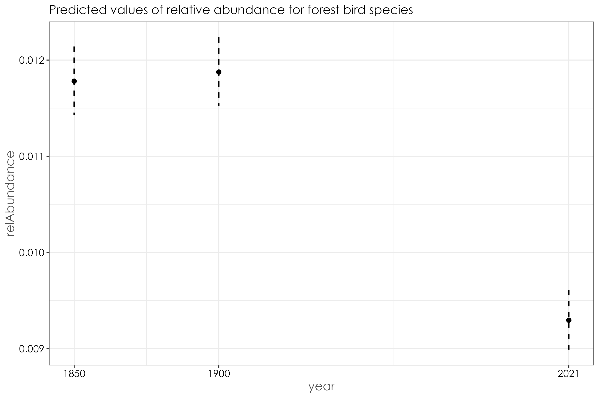
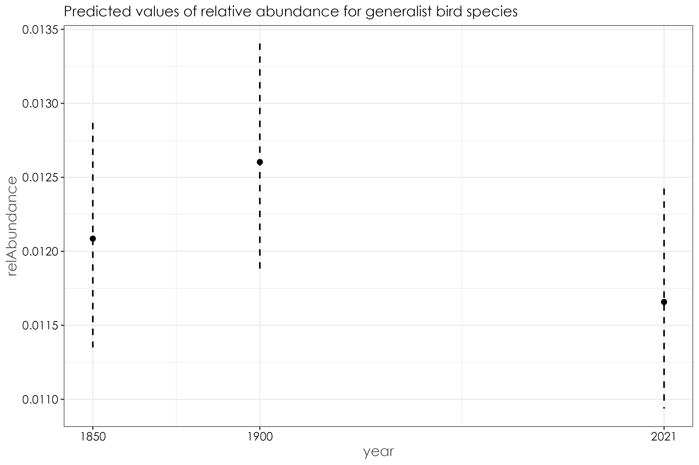

# Examining changes in relative abundance over time as a function of species habitat affiliation  

In this script, we will examine how relative abundance varies as a function of habitat affiliation across time periods for bird communities. We will plot species rank abundances of relative abundance to estimate how values of relative abundance has shifted for each species. In addition, we will run beta regressions to test for significance in relative abundance changes over time. 

## Load necessary libraries
```{r}
library(dplyr)
library(stringr)
library(tidyverse)
library(scico)
library(RColorBrewer)
library(extrafont)
library(sf)
library(raster)
library(lattice)
library(data.table)
library(ggrepel)
library(report)
library(lme4)
library(glmmTMB)
library(multcomp)
library(ggstatsplot)
library(paletteer)
library(ggpubr)
library(goeveg)
library(betareg)
library(ggeffects)
library(patchwork)
library(broom)
library(ggridges)
```

## Load data on species relative abundances
```{r}
relAbun <- read.csv("results/species-relative-abundance-siteLevel.csv")
names(relAbun) <- c("common_name","historical_site_code","year","relAbundance")
```

## Load species trait data  
```{r}
## load in species trait dataset
trait_dat <- read.csv("data/species-trait-dat.csv")

# note: the classification of habitat type was created by comparing habitat affiliation data from the State of India's Birds report (v2; released in 2023). 
# this classification was also vetted independently by two reviewers.
# We used the following trait classifications:
# Forest 
# Grassland 
# Generalist

# Our criteria for each of these classifications includes the following: 
# In the 1850s, the land cover change analysis revealed that the majority of the landscape was largely grasslands and forests. However in 2018, the landscape is largely a mosaic of human-modified land cover types - including wooded habitats (mostly comprising timber plantations and degraded forests), tea plantations, followed by forests and grasslands.
# While the State of India's Birds provides a habitat classification/criteria based on contemporary use of habitats by a species, we classified species based on our resurveys and assuming that a species would either be in a forest affiliated bird species, grassland species or a generalist species in the 1850s. 
# An example in this case is the black and orange flycatcher. While it is commonly found in shola forest habitat, this species is also common in degraded wooded areas, including timber plantations today. However, historically, in the 1850s (due to limited presence of timber plantations compared to 2018), we assume that this is a forest specialist bird as no other wooded habitats apart from forests existed (predominantly) in the 1850s (See 06_land-cover-classification.Rmd)
# Other examples include bird species that prefer open habitats, scrubland and dry grassland - such species have been lumped into the Grassland category as this was the closest habitat similar to the above habitat types in 1850s. Eg. Blue-tailed bee-eater, long-tailed shrike, black-winged kite. 
# If a species is truly a generalist species and is not particularly occupying/specialized on any particular  forested/wooded/grassland habitat, it was classified in the generalist category

## join overall relative abundance dataframe and species trait data 
relAbun <- relAbun %>%
   left_join(., trait_dat, by="common_name") %>%
   filter(Habitat.type != "Wetland") %>% # remove wetland birds
  ungroup()

# count distinct number of species affiliated with a particular habitat type
spCount <- relAbun[,c(1,8)] %>%
  distinct() %>%
  group_by(Habitat.type) %>%
  count()

# Based on the above criteria, 57 species were classified as forest birds, 9 species were classified as grassland birds, 19 species were classified as generalist species.  

# visualization by habitat affiliation
relAbun$Habitat.type <- factor(relAbun$Habitat.type, levels=c("Forest", "Grassland", "Generalist"))

fig_relAbun_habitat <- grouped_ggbetweenstats(
  data = relAbun,
  x = year,
  y = relAbundance,
  grouping.var = `Habitat.type`,
  xlab = "Habitat.type", 
  ylab = "Relative Abundance",
  p.adjust.method = "fdr",
  ggplot.component = list(ggplot2::scale_color_discrete(c("#2c7fb8",'#025a05',"#e34a33"
                                  ))),
  violin.args = list(width = 0)) 

ggsave(fig_relAbun_habitat, filename = "figs/fig_relAbun_habitat_landscapeLevel.png", width = 17, height = 7, device = png(), units = "in", dpi = 300)
dev.off()
```


## Analysis to test for significant differences in relative abundances by species across habitat types

```{r}
## grassland birds
grassland_birds <- relAbun %>%
  filter(Habitat.type == "Grassland")

plots <- list()

for (i in 1:length(unique(grassland_birds$common_name))) {
  
  a <- unique(grassland_birds$common_name)[i]

  # subset data for plotting
  sp <- grassland_birds[grassland_birds$common_name == a, ]
  
  p <- sp %>%
  ggbetweenstats(x = year,
                         y = relAbundance,
                         xlab = "Time Period",
                         ylab = "Relative Abundance", 
                         pairwise.display = "significant",
                         package = "ggsci",
                         palette = "default_jco",
                         title = a,
                 violin.args = list(width=0),
    plotgrid.args = list(nrow = 3),
ggplot.component = list(theme(text = element_text(family = "Century Gothic", size = 15, face = "bold"),plot.title = element_text(family = "Century Gothic",
      size = 18, face = "bold"),
      plot.subtitle = element_text(family = "Century Gothic", 
      size = 15, face = "bold",color="#1b2838"),
      axis.title = element_text(family = "Century Gothic",
      size = 15, face = "bold"))))
  
   ## save plot object
  plots[[i]] <- p
}

# save as a single pdf
cairo_pdf(
  filename = "figs/grassland-bird-relative-abundance-by-TimePeriod.pdf",
  width = 13, height = 12,
  onefile = TRUE
)
plots
dev.off()

## forest birds
forest_birds <- relAbun %>%
  filter(Habitat.type == "Forest")

plots <- list()

for (i in 1:length(unique(forest_birds$common_name))) {
  
  a <- unique(forest_birds$common_name)[i]

  # subset data for plotting
  sp <- forest_birds[forest_birds$common_name == a, ]
  
  p <- sp %>%
  ggbetweenstats(x = year,
                         y = relAbundance,
                         xlab = "Time Period",
                         ylab = "Relative Abundance", 
                         pairwise.display = "significant",
                         package = "ggsci",
                         palette = "default_jco",
                         title = a,
                 violin.args = list(width=0),
    plotgrid.args = list(nrow = 3),
ggplot.component = list(theme(text = element_text(family = "Century Gothic", size = 15, face = "bold"),plot.title = element_text(family = "Century Gothic",
      size = 18, face = "bold"),
      plot.subtitle = element_text(family = "Century Gothic", 
      size = 15, face = "bold",color="#1b2838"),
      axis.title = element_text(family = "Century Gothic",
      size = 15, face = "bold"))))
  
   ## save plot object
  plots[[i]] <- p
}

# save as a single pdf
cairo_pdf(
  filename = "figs/forest-bird-relative-abundance-by-TimePeriod.pdf",
  width = 13, height = 12,
  onefile = TRUE
)
plots
dev.off()

## generalist birds
generalist_birds <- relAbun %>%
  filter(Habitat.type == "Generalist")

plots <- list()

for (i in 1:length(unique(generalist_birds$common_name))) {
  
  a <- unique(generalist_birds$common_name)[i]

  # subset data for plotting
  sp <- generalist_birds[generalist_birds$common_name == a, ]
  
  p <- sp %>%
  ggbetweenstats(x = year,
                         y = relAbundance,
                         xlab = "Time Period",
                         ylab = "Relative Abundance", 
                         pairwise.display = "significant",
                         package = "ggsci",
                         palette = "default_jco",
                         title = a,
                 violin.args = list(width=0),
    plotgrid.args = list(nrow = 3),
ggplot.component = list(theme(text = element_text(family = "Century Gothic", size = 15, face = "bold"),plot.title = element_text(family = "Century Gothic",
      size = 18, face = "bold"),
      plot.subtitle = element_text(family = "Century Gothic", 
      size = 15, face = "bold",color="#1b2838"),
      axis.title = element_text(family = "Century Gothic",
      size = 15, face = "bold"))))
  
   ## save plot object
  plots[[i]] <- p
}

# save as a single pdf
cairo_pdf(
  filename = "figs/generalist-bird-relative-abundance-by-TimePeriod.pdf",
  width = 13, height = 12,
  onefile = TRUE
)
plots
dev.off()
```

## Summary of relative abundance changes by species as a function of habitat affiliation

Above, we performed an ANOVA to test if there are significant differences in species-specific means of relative abundances.

_For grassland bird species (n=9)_
8/9 species showed a significant difference and a decrease in relative abundance between historical and modern survey periods. No differences were observed across time periods for the Pied Bushchat

_For Forest birds:(n=57)_
27 bird species showed a significant decrease in relative abundance in the modern survey period when compared to either one of the historical time periods.
22 bird species showed no differences in relative abundances across time periods/remained stable.
8 bird species showed a significant increase in relative abundance in the modern survey period when compared to either historical survey periods. 
**~52.6% of birds have remained stable and/or increase in relative abundance over time.**

_For generalist birds (n=19):_
10 birds showed no significant differences in relative abundance across time periods.
4 bird species showed significant increase in the modern survey period compared to either one of the historical time periods.
5 birds showed a significant decrease in relative abundance in the modern survey period compared to either one of the historical survey periods. 
**~73.6% of birds remained stable or increased in relative abundance over time**

## Has relative abundance increased or decreased for each species over time?

Based on the above plots and levels of significance for decrease in relative abundance or  we create an additional column for each species to denote if a species has increased or remained stable in relative abundance over time. This column is added by manually inspecting the plots for significance and included in the `species-relative-abundances.csv` file. 

```{r}
## loading the average relative species abundances file
## this file now has a column indicating if a species increased or decreased in relative abundance

mean_relAbun <- read.csv("results/species-relative-abundance.csv")
names(mean_relAbun) <- c("common_name","1850-1900","1900-1950","2021","increase_decrease")

## merge the above file with species trait data
mean_relAbun <- mean_relAbun %>%
   left_join(., trait_dat, by="common_name") %>%
   filter(Habitat.type != "Wetland") %>% # remove wetland birds
  ungroup()

## summary pie chart
fig_relAbun_pieChart <- ggpiestats(
  # arguments relevant for `ggpiestats()`
  data = mean_relAbun,
  x = increase_decrease,
  y = Habitat.type,
  digits.perc = 0,
  plotgrid.args = list(nrow = 2),
ggplot.component = list(theme(text = element_text(family = "Century Gothic", size = 15, face = "bold"),plot.title = element_text(family = "Century Gothic",
      size = 18, face = "bold"),
      plot.subtitle = element_text(family = "Century Gothic", 
      size = 15, face = "bold",color="#1b2838"),
      axis.title = element_text(family = "Century Gothic",
      size = 15, face = "bold"))))

ggsave(fig_relAbun_pieChart, filename = "figs/fig_relativeAbundance_pieChart_increase_decrease.png", width = 15, height = 6, device = png(), units = "in", dpi = 300)
dev.off()

## Now that we have a summary pie chart showcasing the number of species that increased/remained stable and decreased in relative abundance over time, we can plot the relative abundance for the year 2021 as rank abundance plots

## separately for grassland, forest and generalist birds

fig_rankAbund_grass <- mean_relAbun %>%
  filter(Habitat.type == "Grassland") %>%
  ggplot(., aes(x = common_name, y = `2021`, fill = increase_decrease)) +
   geom_bar(stat = "identity", position = "dodge", width = 0.9)+
  scale_fill_manual("Increase/Decrease", values = c("#D95F02",'#1B9E77')) +
  theme_bw() +
  labs(
    x = "\nCommon Name",
    y = "Relative Abundance\n"
  ) +
  theme(
    axis.title = element_text(
      family = "Century Gothic",
      size = 14, face = "bold"
    ),
    axis.text = element_text(family = "Century Gothic", 
                             size = 12),
    axis.text.x = element_text(angle = 90, vjust = 0.5, 
                               hjust = 1),
    aspect.ratio = 2/1)

ggsave(fig_rankAbund_grass, filename = "figs/fig_rankAbundance_grassland.svg", width = 15, height = 12, device = svg(), units = "in", dpi = 300)
dev.off()

## forest birds
fig_rankAbund_forest <- mean_relAbun %>%
  filter(Habitat.type == "Forest") %>%
  ggplot(., aes(x = common_name, y = `2021`, fill = increase_decrease)) +
   geom_bar(stat = "identity", position = "dodge", width = 0.9)+
  scale_fill_manual("Increase/Decrease", values = c("#D95F02",'#1B9E77')) +
  theme_bw() +
  labs(
    x = "\nCommon Name",
    y = "Relative Abundance\n"
  ) +
  theme(
    axis.title = element_text(
      family = "Century Gothic",
      size = 14, face = "bold"
    ),
    axis.text = element_text(family = "Century Gothic", 
                             size = 12),
    axis.text.x = element_text(angle = 90, vjust = 0.5, 
                               hjust = 1))

ggsave(fig_rankAbund_forest, filename = "figs/fig_rankAbundance_forest.svg", width = 22, height = 12, device = svg(), units = "in", dpi = 300)
dev.off()

## generalist birds
fig_rankAbund_generalist <- mean_relAbun %>%
  filter(Habitat.type == "Generalist") %>%
  ggplot(., aes(x = common_name, y = `2021`, fill = increase_decrease)) +
   geom_bar(stat = "identity", position = "dodge", width = 0.9)+
  scale_fill_manual("Increase/Decrease", values = c("#D95F02",'#1B9E77')) +
  theme_bw() +
  labs(
    x = "\nCommon Name",
    y = "Relative Abundance\n"
  ) +
  theme(
    axis.title = element_text(
      family = "Century Gothic",
      size = 14, face = "bold"
    ),
    axis.text = element_text(family = "Century Gothic", 
                             size = 12),
    axis.text.x = element_text(angle = 90, vjust = 0.5, 
                               hjust = 1))

ggsave(fig_rankAbund_generalist, filename = "figs/fig_rankAbundance_generalist.svg", width = 15, height = 12, device = svg(), units = "in", dpi = 300)
dev.off()
```


## Box plots of relative abundance by species trait across time periods 
```{r}
# grassland birds
fig_boxPlot_grass <- ggplot(grassland_birds, aes(x = common_name, y = relAbundance, fill = factor(year))) +
  geom_col(stat = "identity")+
  #geom_boxplot(alpha=0.7)+
  scale_fill_manual(values = c("#2c7fb8",'#025a05',"#e34a33")) +
  theme_bw() +
  labs(
    x = "\nCommon Name",
    y = "Relative Abundance\n"
  ) +
  theme(
    axis.title = element_text(
      family = "Century Gothic",
      size = 14, face = "bold"
    ),
    axis.text = element_text(family = "Century Gothic", 
                             size = 12),
    axis.text.x = element_text(angle = 90, vjust = 0.5, 
                               hjust = 1)) 

ggsave(fig_boxPlot_grass, filename = "figs/fig_boxPlot_grassland.png", width = 15, height = 10, device = png(), units = "in", dpi = 300)
dev.off()

# forest birds 
fig_boxPlot_forest <- ggplot(forest_birds, aes(x = common_name, y = relAbundance, fill = factor(year))) +
  geom_boxplot(alpha=0.7)+
  scale_fill_manual(values = c("#2c7fb8",'#025a05',"#e34a33")) +
  theme_bw() +
  labs(
    x = "\nCommon Name",
    y = "Relative Abundance\n"
  ) +
  theme(
    axis.title = element_text(
      family = "Century Gothic",
      size = 14, face = "bold"
    ),
    axis.text = element_text(family = "Century Gothic", 
                             size = 12),
    axis.text.x = element_text(angle = 90, vjust = 0.5, 
                               hjust = 1)) 

ggsave(fig_boxPlot_forest, filename = "figs/fig_boxPlot_forest.png", width = 22, height = 10, device = png(), units = "in", dpi = 300)
dev.off()

# generalist birds
fig_boxPlot_generalist <- ggplot(generalist_birds, aes(x = common_name, y = relAbundance, fill = factor(year))) +
  geom_boxplot(alpha=0.7)+
  scale_fill_manual(values = c("#2c7fb8",'#025a05',"#e34a33")) +
  theme_bw() +
  labs(
    x = "\nCommon Name",
    y = "Relative Abundance\n"
  ) +
  theme(
    axis.title = element_text(
      family = "Century Gothic",
      size = 14, face = "bold"
    ),
    axis.text = element_text(family = "Century Gothic", 
                             size = 12),
    axis.text.x = element_text(angle = 90, vjust = 0.5, 
                               hjust = 1)) 

ggsave(fig_boxPlot_generalist, filename = "figs/fig_boxPlot_generalist.png", width = 15, height = 10, device = png(), units = "in", dpi = 300)
dev.off()

# Grassland birds are the biggest losers; generalist birds are the biggest winners while forest birds show mixed responses depending on the species
```


## Create a visualization of rank abundances by species habitat affiliation as a function of time period
```{r}
trial <- grass_rank %>%
  mutate(status = )
```


## Are there significant decreases in relative abundance by time periods across habitat affiliations?

We will run beta regressions to answer the above question as the data is bounded between zero and 1. 
```{r}
# change the year column to factor
relAbun$year <- factor(relAbun$year)

beta_overall <- betareg(relAbundance ~ year,data = relAbun)
summary(beta_overall)

# Call:
# betareg(formula = relAbundance ~ factor(year), data = relAbun)
# 
# Standardized weighted residuals 2:
#     Min      1Q  Median      3Q     Max 
# -2.7460 -0.3421 -0.0052  0.1419  4.4420 
# 
# Coefficients (mean model with logit link):
#                  Estimate Std. Error  z value Pr(>|z|)    
# (Intercept)      -4.42983    0.01317 -336.371   <2e-16 ***
# factor(year)1900  0.01608    0.01805    0.891    0.373    
# factor(year)2021 -0.22679    0.01899  -11.940   <2e-16 ***
# 
# Phi coefficients (precision model with identity link):
#       Estimate Std. Error z value Pr(>|z|)    
# (phi)  261.911      5.357   48.89   <2e-16 ***
# ---
# Signif. codes:  0 '***' 0.001 '**' 0.01 '*' 0.05 '.' 0.1 ' ' 1 
# 
# Type of estimator: ML (maximum likelihood)
# Log-likelihood: 1.913e+04 on 4 Df
# Pseudo R-squared: 0.05352
# Number of iterations: 22 (BFGS) + 3 (Fisher scoring)  

# plot predicted model estimates
fig_beta_overall <- ggpredict(beta_overall) %>%
  plot() +
  set_theme(base = theme_bw(),
          theme.font = "Century Gothic",
          axis.title.size = 1.2,
          axis.textsize = 1,
          axis.textcolor = "black") +
    ggtitle("Predicted values of relative abundance for all data")

ggsave(fig_beta_overall, filename = "figs/fig_beta_relAbundance_overall.png", width = 9, height = 6, device = png(), units = "in", dpi = 300)
dev.off()
```


## Forest birds
```{r}
# change the year column to factor
forest_birds$year <- factor(forest_birds$year)

beta_forest <- betareg(relAbundance ~ year, data = forest_birds)
summary(beta_forest)

# Call:
# betareg(formula = relAbundance ~ year, data = forest_birds)
# 
# Standardized weighted residuals 2:
#     Min      1Q  Median      3Q     Max 
# -2.8875 -0.3700 -0.0043  0.1296  4.3339 
# 
# Coefficients (mean model with logit link):
#              Estimate Std. Error  z value Pr(>|z|)    
# (Intercept) -4.429361   0.015560 -284.660   <2e-16 ***
# year1900     0.008433   0.021403    0.394    0.694    
# year2021    -0.239189   0.022568  -10.598   <2e-16 ***
# 
# Phi coefficients (precision model with identity link):
#       Estimate Std. Error z value Pr(>|z|)    
# (phi)   281.73       7.02   40.13   <2e-16 ***
# ---
# Signif. codes:  0 '***' 0.001 '**' 0.01 '*' 0.05 '.' 0.1 ' ' 1 
# 
# Type of estimator: ML (maximum likelihood)
# Log-likelihood: 1.294e+04 on 4 Df
# Pseudo R-squared: 0.05652
# Number of iterations: 26 (BFGS) + 2 (Fisher scoring)

# plot predicted model estimates
fig_beta_forest <- ggpredict(beta_forest) %>%
  plot() +
  set_theme(base = theme_bw(),
          theme.font = "Century Gothic",
          axis.title.size = 1.2,
          axis.textsize = 1,
          axis.textcolor = "black") +
    ggtitle("Predicted values of relative abundance for forest bird species")

ggsave(fig_beta_forest, filename = "figs/fig_beta_relAbundance_forestBirds.png", width = 9, height = 6, device = png(), units = "in", dpi = 300)
dev.off()
```



## Grassland birds
```{r}
grassland_birds$year <- factor(grassland_birds$year)

beta_grassland <- betareg(relAbundance ~ year, data = grassland_birds)
summary(beta_grassland)

# Call:
# betareg(formula = relAbundance ~ year, data = grassland_birds)
# 
# Standardized weighted residuals 2:
#     Min      1Q  Median      3Q     Max 
# -4.6046 -0.3444  0.0742  0.1940  5.0030 
# 
# Coefficients (mean model with logit link):
#              Estimate Std. Error  z value Pr(>|z|)    
# (Intercept) -4.512997   0.026442 -170.673   <2e-16 ***
# year1900     0.005862   0.036941    0.159    0.874    
# year2021    -0.616943   0.043370  -14.225   <2e-16 ***
# 
# Phi coefficients (precision model with identity link):
#       Estimate Std. Error z value Pr(>|z|)    
# (phi)   709.31      43.79    16.2   <2e-16 ***
# ---
# Signif. codes:  0 '***' 0.001 '**' 0.01 '*' 0.05 '.' 0.1 ' ' 1 
# 
# Type of estimator: ML (maximum likelihood)
# Log-likelihood:  2316 on 4 Df
# Pseudo R-squared: 0.4275
# Number of iterations: 69 (BFGS) + 2 (Fisher scoring)

# plot predicted model estimates
fig_beta_grassland <- ggpredict(beta_grassland) %>%
  plot() +
  set_theme(base = theme_bw(),
          theme.font = "Century Gothic",
          axis.title.size = 1.2,
          axis.textsize = 1,
          axis.textcolor = "black") +
    ggtitle("Predicted values of relative abundance for grassland bird species") 

ggsave(fig_beta_grassland, filename = "figs/fig_beta_relAbundance_grasslandBirds.png", width = 9, height = 6, device = png(), units = "in", dpi = 300)
dev.off()
```


## Generalist birds
```{r}
generalist_birds$year <- factor(generalist_birds$year)
 
beta_generalist <- betareg(relAbundance ~ year, data = generalist_birds)
summary(beta_generalist)

# Call:
# betareg(formula = relAbundance ~ year, data = generalist_birds)
# 
# Standardized weighted residuals 2:
#     Min      1Q  Median      3Q     Max 
# -2.1571 -0.3896  0.0175  0.1774  3.8070 
# 
# Coefficients (mean model with logit link):
#             Estimate Std. Error  z value Pr(>|z|)    
# (Intercept) -4.40370    0.03241 -135.881   <2e-16 ***
# year1900     0.04163    0.04368    0.953    0.341    
# year2021    -0.03730    0.04433   -0.841    0.400    
# 
# Phi coefficients (precision model with identity link):
#       Estimate Std. Error z value Pr(>|z|)    
# (phi)  180.654      7.907   22.85   <2e-16 ***
# ---
# Signif. codes:  0 '***' 0.001 '**' 0.01 '*' 0.05 '.' 0.1 ' ' 1 
# 
# Type of estimator: ML (maximum likelihood)
# Log-likelihood:  4059 on 4 Df
# Pseudo R-squared: 0.004396
# Number of iterations: 27 (BFGS) + 2 (Fisher scoring) 

# plot predicted model estimates
fig_beta_generalist <- ggpredict(beta_generalist) %>%
  plot() +
  set_theme(base = theme_bw(),
          theme.font = "Century Gothic",
          axis.title.size = 1.2,
          axis.textsize = 1,
          axis.textcolor = "black") +
    ggtitle("Predicted values of relative abundance for generalist bird species") 

ggsave(fig_beta_generalist, filename = "figs/fig_beta_relAbundance_generalistBirds.png", width = 9, height = 6, device = png(), units = "in", dpi = 300)
dev.off()
```



